* content
{:toc}

网址： http://neuralnetworksanddeeplearning.com/chap1.html

## 本文要点总结及启示

* 作者带领我们重头搭建一个NN。
从neuron的选取，到output layer的选取， 以及cost function的选取都很考究。
**遵循的大原则**就是：权值或bias的微小变化必须得能够引起输出的微小变化，这是能够学习的条件，当然与之对应的能够学习好的条件就是，得能够引起cost function的微小变化
* 上一条的启示
很多ad hoc的东西其实背后蕴含了很多heuristic的东西，这些东西组成了揭示事物本质的东西
* 作者构建NN的时候先定网络架构，然后才是学习算法
期间，要保证每一步的可行性，正如FIS那样结构辨识于参数辨识的分离，这个启示可大了：你要想让你的system按照你的意愿去work，你每一步都不能掉以轻心，最好是搞懂每一步这么做的理由，以及这么做的机理。
当然，更重要的是，一定不要陷入细节，从而丧失了大局观。正如做数学题的经验，一开始你看到题目肯定会有一些想法，但千万不要从这个小想法直接去思考，而是要厘清所有条件，将更高层次的东西写下来，避免被忽略；即先定框架，再顾细节，要不然会被水淹没，不知所措。

## 前言
* 人类视觉的伟大
对于手写字符的识别
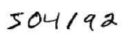
人类很容易就能识别很准，因为在大脑半球中， V1区（即 primary visual cortex）有 1.40亿的神经元及数百亿的连接，而且还有V2, V3, V4, and V5 区- doing progressively more complex image processing.
这样每个人脑袋里都有一个supercomputer，并且经过数亿年进化的调参已经能够adpat to理解这个世界了，以至于人类很容易就能搞字符识别、轻易make sense of 眼前看到的事物。
但我们一般意识不到视觉任务其实是很难的。
* visual pattern recognition 的困难
当我们尝试写一个程序来识别这些数字的时候就会发现原来visual pattern recognition是很难的。
正如传统的program所做的那样，我们需要将intuition转化成代码，如“9”的特征就是上面一个圈儿，然后往左下角撇一下，但这个很难用算法来表达，即如果精确地表示这个intuition的话需要考虑很多特殊情况。 It seems hopeless
* 用NN的approach
Neural networks approach其实是另一种解决方式：你给我一堆训练样本，然后develop a system来学习训练样本，即从数据中自动infer rules for recognizing handwritten digits。
**给的数据越多，我就会对当前的任务（如手写字）学习的越多**，因此精度越高
* 本章小程序
总共74行python代码，能达到96%的精度
在后边章节，我们要**develop ideas，以将其提升至 99%**
* 为啥要选“ 手写字符的识别”
因为它是用来学习NN的一个很好的原型问题（prototype problem）
作为一个 原型问题，它很具有挑战性-你解决了它不是啥壮举，但又没那么难（难指的是要么需要多么复杂的解，要么需要大量的计算资源）
也可用来develop更高级的技巧即DL
* 本章的point
我们 **要develop 很多NN的key ideas** （即，NN的重要组成：the perceptron and the sigmoid neuron，以及SGD）
focus on explaining **why things are done the way they are, and on building your neural networks intuition** . 
##  Perceptrons
Perceptrons发明于五六十年代，一堆二进制的输入，一个二进制的输出
* 数学形式
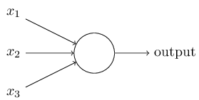
输入输出应该是啥关系呢？
首先引入权值来表示每个输入对于输出的影响，然后加权求和，如果大于某个阈值就输出1，反正就是0
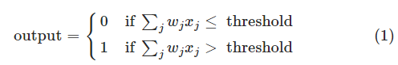
* 一种“决策”的解释
采用不同的权值和阈值，我们就会得到不同的决策模型。
这玩意儿虽然简单，但是它的意义却很大：**对于各种evidence（由x来表示）进行加权来决策**
并且很容易想到， ** 一个复杂的Perception网络能够做出更加精细的决策 **
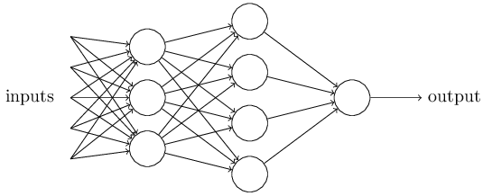
注意，第一层只要三个perception，并且只能做出很简单的决策，但第二层的决策是在第一层的决策的基础上做的。
**我们认为第二层的决策比第一层的决策more complex and more abstract level**
显然第三层的决策更加complex。
* 简化表示
将$\sum_j w_j x_j$简化成$w \cdot x \equiv \sum_j w_j x_j$，并且将1式的阈值挪到不等号左边，变成bias：$ b \equiv
-\mbox{threshold}$
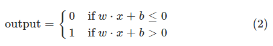
上面有了权值的解释，现在也给bias一个解释吧。从决策的角度来讲，我们假设w和x都是正的，那么一个正的阈值b能使perception更容易输出1，若阈值b为负，则更难输出1
* 从“计算角度”的解释，走向希望
perception很容易构造一个异或门
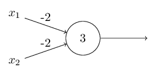
由于异或门 is universal for computation，因此perception可以用于构造任意logical function
这个计算角度的解释即好也不好，好的地方在于perceptron的网络可以用于计算，不好的地方在于，让我们感觉这玩意儿只是一种新的异或门罢了，没啥好的。
如果用另一种玩儿法，其实没那么坏了：我们可以设计学习算法，以自动调节权值和偏置，这个调节只根据输入输出来搞，不需要人工干预。
这样perception网络就和普通的逻辑门电路区别开了，我们的 perception网络可以简单地用学习来解决问题，但直接设计一个普通的电路去解决这个问题更难一些。
##  Sigmoid neurons
* 网络学习需要满足什么条件
对于字符识别任务来说，我们期望休息到一堆权值参数和偏置参数，这样网络输出就能对数字进行分类了。
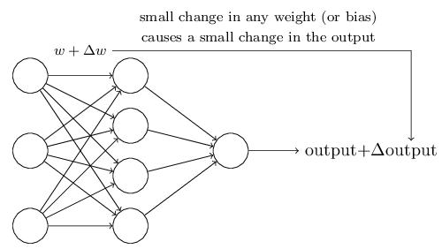
**学习需要满足的条件：加入我们对某一个weight或bias加一个小的change，那么这个改变只能引起输出的微小改变**
这样，我们就能调节这些weights and biases，使网络能够正确输出了。
**如果我们不断条件这些weights and biases就能产生更好的结果，那么network就是在学习**
* perceptron 网络存在的问题
网络中任意一个perception的weights or bias发生微小的改变都可能引起输出的反转，如0变1
这个特性很讨厌嘛，我们就没法通过modify the weights and biases来使得network达到我们期望的behavior了
* sigmoid neuron 使网络可以学习
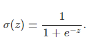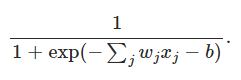
首先我们关心的是，sigmoid和perception的区别在哪儿？
由于$z = w \cdot x+b$,所以当z是个很大的正数的时候， sigmoid 输出就是1，z是个很小的负数的时候， sigmoid 输出就是0，因此两者不同的地方在于z不大不小的时候，看图
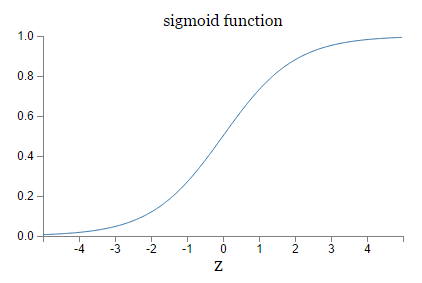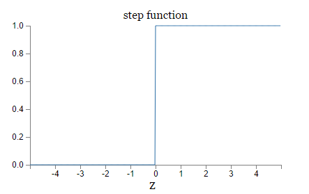
sigmoid的平滑性意味着，小的权值或bias的改变，引起的是输出的微小改变：
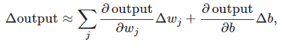
也就是说，$ \Delta \mbox{output}$是$ \Delta w_j$和$ \Delta b$的线性函数
实际上，不同的激活函数在上式的体现就是：偏微分的不同啦
 * 练习题
就是告诉我们啊，如果给sigmoid的z乘以一个很大的正数，那么它就变成perception了
## The architecture of neural networks
* 隐含层虽无法直接研究透彻，咱们还是可以玩出花样的
输入输出的确定 is often straightforward，但hidden layer不太好确定，也很难用几个经验法则来说清楚。
退而求其次，人们已经试出来很多 **heuristics，使得NN能有一些我们期望的特性**：如有一些 heuristics可以帮助我们来对隐含层数目与训练时间进行trade off。
* 有环网也是可以玩儿的
我们一般碰到的都是 feedforward neural networks，即没有环：information is always fed forward, never fed back
如果有了loop，那么neuron的输入不就取决于输出了，这还咋玩儿？
别急，有一个trick，让这些neuron的fire状态只持续一定时间，这样就不会有问题了。因为一个neuron的输出并不能立马就能影响它的输入，而是过一会儿才会有影响的。
* 作者对RNN的评价
RNN仍然extremely interesting，但没有FNN那么influential。
They're much closer in spirit to how our brains work than feedforward networks. 

## 确定架构 A simple network to classify handwritten digits
* 整体架构
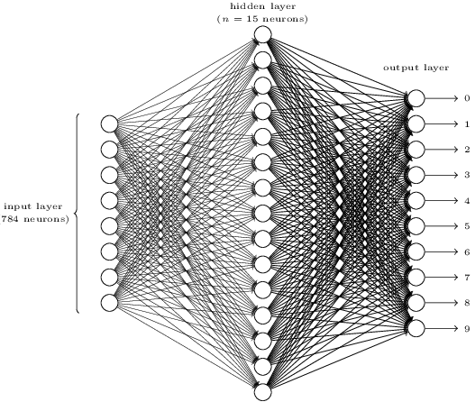
输入层：由于一个输入图像是28x28的因此直接用784个neuron代替啦。
隐含层的个数先定为15个，这个在实验的时候还是得多试几个的。
输出层：总共10个数字，因此用十个neuron代替，哪个大就取哪个作为结果。
* 网络结构设计中需要intuition：对于输出层个数（representation）的思考
有人说了，输出总共有10个结果，我用4位二进制编码不更好、更有效efficient？
这个问题的ultimate justification：这两种都试一下，哪个效果好就用哪个，当然结果是10个的比较好。
对于这个结果的解释，作者使出了大招：**用intuition和特例去理解网络架构**
对于字符0来说，可以认为，隐含层的neuron做的工作就是看一下输入中是否包含以下几个组成部分：
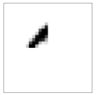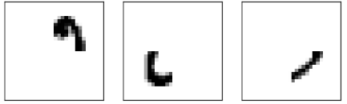
如果都有，那么输出层就直接将隐含层的检测结果直接加权就可以做决策了。这时候用10个neuron是很自然的。
如果用 4位二进制编码，那么隐含层的检测结果（即evidence）是很难和这个二进制输出进行转换的，即0和这个数的最高位、最低位咋转化等。即这俩东西很难有啥关系。
当然，以上仅仅是一种heuristic，但**这种heuristic可以帮助我们设计好的网络架构**，因此要发扬光大啊
* 习题来啦（上面网络的输出到二进制的转换）
假如上边的网络已经设计好了，也训练好了，即输入为0，那么输出层只有0号neuron输出为1，其它认为都是0，我们再加一层，请你确定这最后一层的权值，使之完美转化为二进制。
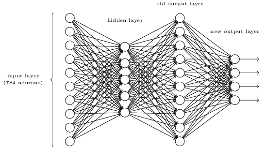
分析一下：不失一般性，我们将四个输出最上面的那个定义为最低位吧，且将其bias都设为0，很明显对于0000,0001,0010,0011,0100等输出，我们的上一层分别对应0000000000， 0000000001， 0000000010， 0000000011， 0000000100等。
这样对应于数字0的输出，我们可以列一个方程：$w_{00}\bowtie0,w_{10}\bowtie0,w_{20}\bowtie0,w_{30}\bowtie0$,对于数字1，有方程：$w_{01}\bowtie1,w_{11}\bowtie0,w_{21}\bowtie0,w_{31}\bowtie0$，注意那个奇怪的符号$\bowtie$表示对应的意思，即经过左边sigmoid neuron之后变成了0或1。这些方程有一个特点，每次都可以确定一个权值，这样总共列出4x10个方程，所以权值矩阵就求出来了。
## Learning with gradient descent
数据集：MNIST data set
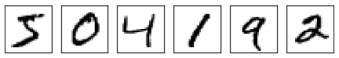
训练集是250人的六万多个image，测试集是另外250人的一万个数据。
输出层的表示：6用$y(x) = (0, 0, 0, 0, 0, 0, 1, 0, 0, 0)^T $表示
目标：学习到一堆权值和bias，使得对于所有输入x，网络输出都能够逼近y(x)
衡量学习的好坏：cost function、 loss or objective function：
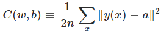
a是网络输出，y(x)是真实label对应的编码
上面这个就是二次损失，又称MSE（均方误差）
* cost function的合理性
如果对于每一个x，都能用网络输出a很好滴逼近y(x)，C(w,b)就小
如果 C(w,b)大了，就说明对于很多x， y(x)都没有被a很好滴逼近。
* 为啥用这个二次损失呢
有人说了，我们的真实目标其实就是分类正确率嘛，为啥不直接最小化分类 准确性 ？
你搞出一个proxy measure算哪样？
问题是，正确率这个东西，并不是权值和bais的smooth function。 即 权值和bais的微小变化不能引起输出的微小变化
话又说回来了，smooth的function多的是，你为啥钟情这一个？其实啊，这个仅仅是ad hoc的选择，当然不同的选择不同的结果嘛。
二次损失对于学习basics of learning in neural networks已经足够啦。
* 重申学习问题的形式
现在忘掉网络结构相关的东西，正式转入我们的Learning问题，第一步就是将符号表示变一下
用C(v)表示目标函数，权值和bias用v=v1,v2,…来表示。
* 解析法的无奈
直接微分求解不就行了么？
当然不行了，我的变量特别多，甚至上亿个，你去解解试试？
* 作者理解东西的一点人生经验
不出意外，是特例法。如将目标函数想象为二维的
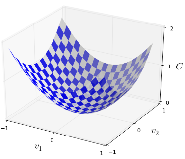
这么搞其实很高明： It just happens that sometimes that picture breaks down。
意思就是，当你无法或很难理解一个事物的时候（ that picture breaks dow）就用特例去理解它。
Good thinking about mathematics often involves juggling multiple intuitive pictures, learning when it's appropriate to use each picture, and when it's not.
* 更新方程
注意我们的大目标：找到v的变化方向，使得输出减小（即输出改变量为负）
用$\Delta v_1$表示v1的微小变化，其他同理，那么目标函数的改变量可以用下式逼近
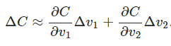
换个形式，
$\Delta v \equiv (\Delta v_1, \Delta v_2)^T$
$ \begin{eqnarray}
  \nabla C \equiv \left( \frac{\partial C}{\partial v_1},
  \frac{\partial C}{\partial v_2} \right)^T.
\tag{8}\end{eqnarray}$
紧凑一点就是：
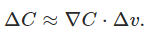
如果我们取$\Delta v = -\eta \nabla C$,那么： $ \Delta C \approx -\eta
\nabla C \cdot \nabla C = -\eta \|\nabla C\|^2$，好了目标实现了，只需要这么搞就行了：
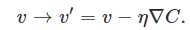
有人问了，我的$\eta$能取很大么？当然不能了，你 $\eta$大了， $\Delta v$就不是微小改变量了，上式的逼近就不成立了（即约等于不成立）。
再加一句话：上式对于n元的也成立。
* 在某种意义上，梯度下降对于搜索最小值是最优的
加入我们限定$ \| \Delta v \| = \epsilon$，可以很容易得到如下结论（用柯西不等式）
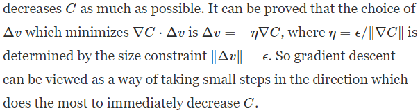
* 下降的小球
作者用在山谷中下降的小球来帮助理解。
小球遵循的是牛顿定律（有速度，有冲量，能跨过小沟），而我们的梯度下降其实没那么复杂，仅仅是找到下降的方向。
* 梯度下降的变种
有人就嫌弃梯度下降只搞出一个方向，很不爽啊。如果模拟小球下降可以不（即多考虑一点）？
很不好的一点就是，这么搞之后就得计算二阶偏微分，计算量就太大了。
* SGD随机梯度下降法
总结一下：
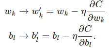
但为了计算$\nabla C$就得计算$\nabla C_x$,然后再平均$ \nabla C = \frac{1}{n} \sum_x \nabla C_x$,这样就得等待所有x计算完毕才能进行一次更新，计算量太大了。
一种解决方法就是SGD，即每次用一些样本来计算梯度的方向，以逼近整体样本的情形：
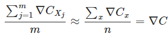
这样：
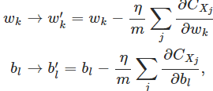
注意，我们关心的并不是具体的梯度值，而是梯度的方向，因此
>the estimate won't be perfect - there will be statistical fluctuations - but it doesn't need to be perfect: all we really care about is moving in a general direction that will help decrease CC, and that means we don't need an exact computation of the gradient.

* 对于无法直接处理的东西，如高维的情况，如何才能泰然自若
超过三维了，你不能可视化了，你没法直接获得intuition了，你以为那些牛逼的数学家们就有更好的方法啦？
其实不然，牛逼的数学家们只是有了一个trick：The trick they use, instead, is to develop other ways of representing what's going on.
即用其他方法来表示这个东西。就拿梯度下降来说，我们用$\Delta C$的algebraic (rather than visual) representation来figure out how to move so as to decrease C。
那些能在高维思考的大牛们只是技巧比咱多罢了（即库存了很多技巧），如algebraic trick。
当然了，这些技巧肯定比不过咱们三维中可视化的那么简约（simplicity）。但你一旦build up a library of such techniques， you can get pretty good at thinking in high dimensions.
这里： http://mathoverflow.net/questions/25983/intuitive-crutches-for-higher-dimensional-thinking   有一个讨论 Intuitive crutches for higher dimensional thinking  ，即职业数学家们在高维思考问题的技巧。

## Implementing our network to classify digits
* 数据集
由于 LeCun 的数据集太复杂，所以作者从 http://www.deeplearning.net/tutorial/gettingstarted.html  搞到可以直接用Numpy读的压缩包。
在此数据集中，前六万个分成两部分：五万个作为训练集，一万个作为验证集。后一万个作为测试集。
本章不用验证集。
* 超参数
本书以后在讨论它们的选择。
这些超参数就是并非由 learning algorithm选择的参数，用于区别 learning algorithm学习到的参数（w和b）
* 边训练边 tracking progress
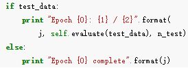
这个和我们无监督学习的可视化类似。
在聚类算法中，可以在每次迭代后查看训练的效果，因为是无监督的所以只能这么看效果了，当然超过两维就不好观察了。
而有监督学习具有天然的优势，只需要一个“学习精度”就可以表征学习效果了，我聚类望尘莫及啊。
* 原型代码和 production code的区别
>these Python scripts are intended to help you understand how neural nets work, not to be high-performance code! And, of course, once we've trained a network it can be run very quickly indeed, on almost any computing platform.

* 实验啦
在 net.SGD(training_data, 30, 10, 3.0, test_data=test_data)即，30个epoch，mini-batch size为10，学习速率为3的情况下，
 net = network.Network([784, 30, 10])即30个隐含层neuron的效果比 net = network.Network([784, 100, 10])即100个的效果差了一点点
所以啊，隐含层neuron多了就是好啊，但明显训练速度慢了哈哈。
* 抛出问题：超参数如何选？ 
在以上实验中，学习速率咱们选择了3，效果不错，但要是选成了η=0.001，效果就很差了
以下就是各种intuition了：
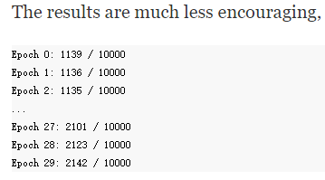
作者从中看出来，学习速率很慢啊，因此就得增加学习率$\eta$,如变成0.01，变了之后效果好了（学习速度也快了），那就得再加，变成1，这样就和咱们上边的实验3很接近了。
intuition就是： **(If making a change improves things, try doing more!**
因此，即使我们一开始选的超参数并不好，我们还是可以得到足够的information来improve超参数的选择的。
一般来说，debug一个NN是很challenging的， This is especially true when 选择的初始超参数的效果并不比 random noise好的时候。
如学习速率一开始选了100，效果很差啊
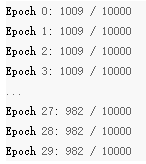
但我们很难确定是不是 learning rate选的不对，也可能是初始权值不对，训练数据不够，epoch不够，网络结构不行……
* 结论：debugging a neural network is not trivial
虽然NN避免了 ordinary programming的麻烦，但不好debug。
**. You need to learn that art of debugging in order to get good results from neural networks**
更一般的，我们需要**develop heuristics for choosing good hyper-parameters and a good architecture**
*   well-designed neural networks 力压 baseline tests效果
The simplest baseline： randomly guess，很明显是10%
 a less trivial baseline： 数一下数字的灰度值，实验表明是22%
20%到50之间的结果也很好办到，但要更好的精度的话就得使用established machine learning algorithms了。
SVM如果调教好的话能达到 98.5%
但  well-designed neural networks 是完爆其它算法的，2013年的记录是 9,979 of 10,000即仅错了21个，注意到，数据集中有很多人类都很难认清的东西：
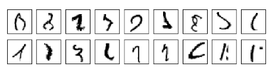

* 越简单越幸福
通常人们认为字符识别这种 complicated problem需要复杂的算法，但2013上面那个记录是很简单的，就比咱们上面实现的那个算法多了一点variations。
其实complexity是从data中学习到的。（ All the complexity is learned, automatically, from the training data.）
在某种意义上，一个人生经验就是：
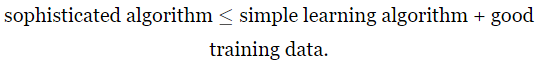\

## Toward deep learning
* 问题：神经网络缺乏解释性
神经网络 gives impressive performance，但这个performance太神秘了：这些权值都是自动学习到的，因此我们无法立马解释网络到底咋达到这个performance的。
* 问题来了，我们能设法理解NN工作的principle么，有了这些principle，我们还能do better么
假设NN可以lead to AI。 在AI research的早期，人们希望
> people hoped that the effort to build an AI would also help us understand the principles behind intelligence and, maybe, the functioning of the human brain. But perhaps the outcome will be that we end up understanding neither the brain nor how artificial intelligence works!

* 回答以上问题：weighing evidence的例子
假设我们要纯手工（设计权值和bias）打造一个network，那么我们就得将问题分解，如判断人脸的例子
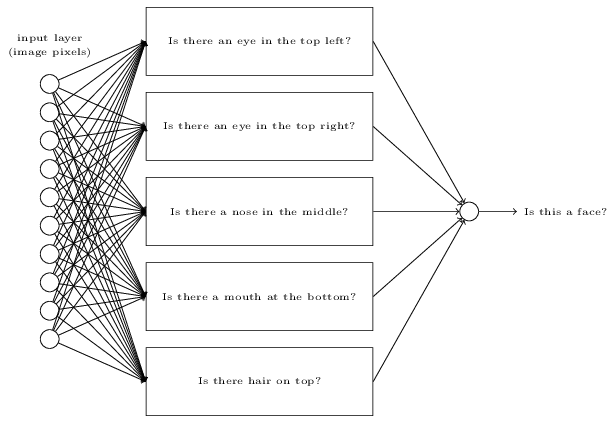
但每一个子问题还可以分解
![]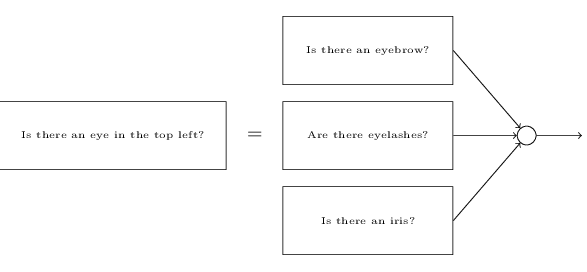
最后分解到pixel级别进行判断。
每一层都回答一个问题，后边的layer用来搞复杂抽象的concept，这样就得到了：**deep neural networks**
* 曙光
以上的人脸检测network当然无法手动设计了，肯定得用Learning哈，但不幸的是，八九十年代用SGD和BP训练的deep network，学习的特别缓慢，实际应用中太慢了，根本没法用（只有某些特殊的architecture可以很幸运地进行训练）。
2006年以来，用来训练DNN的technique逐渐出现，虽然还是基于SGD和BP，但引入了新的idea
现在5到10个隐含层都是很routine了，它们比shallow NN的效果好多了，原理：就是deep net能够**build up a complex hierarchy of concepts**
* 释怀
DNN需要各种technique就行conventional  programming要想写一下复杂的程序，必须得使用模态化设计和abstraction一样。
深度网络和浅网络的关系，就像，一个能够进行函数调用的编程语言和一个无法进行函数调用的语言一样
虽然神经网络以及 conventional  programming都需要abstraction，但在NN中的作用很不一样。

