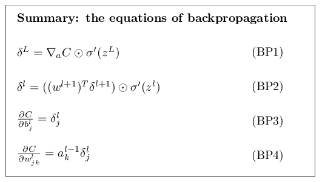
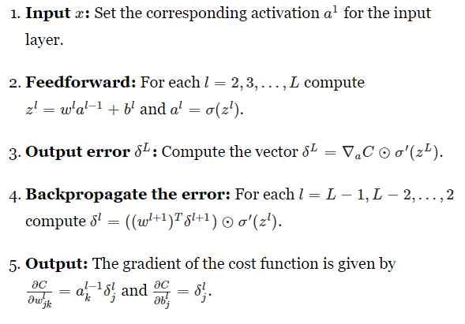
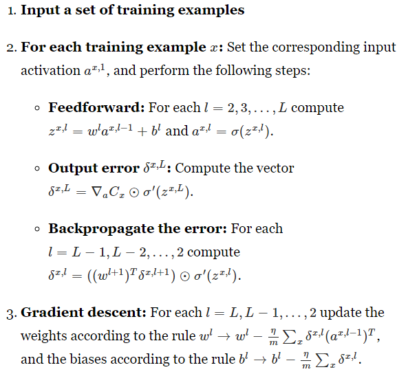
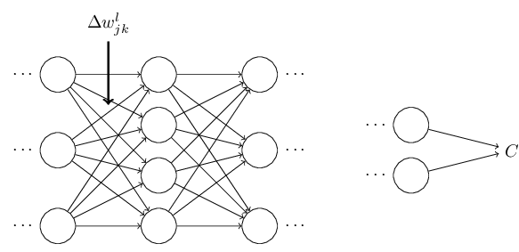
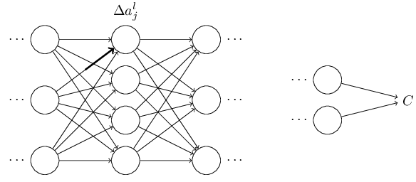
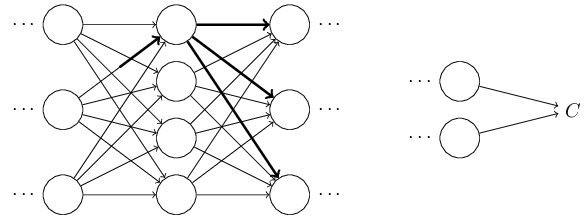
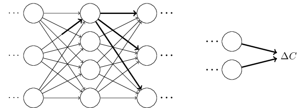

* content
{:toc}

## 前言
* BP初识
BP只是计算梯度的一种快速算法。
BP算法始创于70年代，但到了86年Hinton一篇nature文章发表以后，BP才被fully appreciated，这篇文章表明，对于好几种NN，BP都比以往的Learning算法要快，这就使得NN能够解决很多难以解决的问题。
* 为何要学习BP
BP的核心就是cost function对于权值或bias的偏微分，即：$ \partial  C / \partial w$,它告诉我们，当我们改变weight 或 bias的时候，cost C 的变化速率。
这个表达式的beauty在于，它的每一项都有 a natural, intuitive interpretation
因此，BP不仅是一个Learning算法，它还提供我们一些 detailed insights into how changing the weights and biases changes the overall behaviour of the network. That's well worth studying in detail.
## 符号说明
其实符号的选取是很重要的，能够简化表达式，简化之后就很容易进行进一步简化，并发现insight
* $w^l_{jk}$:用上标 $ l $ 表示第几层，整体表示第 $ l $ 层的第 $ j $ 个neuron与第 $ l-1 $ 层的第 $ k $ 个neuron之间的权值
*   $ b^l_j$:同上
*   $ l $ 层的第 $j$ 个neuron的激活activation或输出即 $a_j^{l}$ 为：
$ \begin{eqnarray}
  a_j^{l} = \sigma \left( \sum_k w^{l}_{jk} a^{l-1}_k + b^l_j \right),
\tag{23}\end{eqnarray}$
简化成矢量形式：
$ \begin{eqnarray}
  a^{l} = \sigma(w^l a^{l-1}+b^l).
\tag{25} \end{eqnarray} $
作者在此处夸了一下这种表示的好处，我感觉最重要的就是方便顶层思考了，即 global way of thinking，当然计算效率也算。
*   $z^l \equiv w^l a^{l-1}+b^l$,即第$l$层的加权输入。
* 两个vector之间的elementwise product，即 Hadamard product or Schur product $ \begin{eqnarray}
\left[\begin{array}{c} 1 \\ 2 \end{array}\right]
  \odot \left[\begin{array}{c} 3 \\ 4\end{array} \right]
= \left[ \begin{array}{c} 1 * 3 \\ 2 * 4 \end{array} \right]
= \left[ \begin{array}{c} 3 \\ 8 \end{array} \right].
\tag{28}\end{eqnarray}$
## cost function的两个假设
实际上就是能够进行BP运算要求的，对于 cost function的形式的假设
* 第一个假设就是， cost function 必须对于每一个样本都能算, 即，可以写成，$C = \frac{1}{n} \sum_x C_x$
背后的reason就是：要能通过多个样本的$ \partial C_x  / \partial w$的平均来逼近（recover）$ \partial C / \partial w$
* 第二个假设，cost function能够写成网络输出的function
对于二次损失函数就是：$ \begin{eqnarray}
  C = \frac{1}{2} \|y-a^L\|^2 = \frac{1}{2} \sum_j (y_j-a^L_j)^2,
\tag{27}\end{eqnarray}$
## BP的四个基本方程
* BP背后的故事
BP传播的error是重中之重啊，为了便于理解，作者假设某个neuron处有个daemon，专门负责给它的输入增加一个改变量$\Delta z^l_j$,因此该neuron的输出（即activation）变成了$\sigma(z^l_j+\Delta z^l_j)$，而最终的cost的改变量为：$\frac{\partial C}{\partial z^l_j} \Delta z^l_j$
如果这个daemon特别好，将 $\Delta z^l_j$设为 $\frac{\partial C}{\partial z^l_j}$的 opposite sign，就能保证 $\frac{\partial C}{\partial z^l_j} \Delta z^l_j$为负了。
注意，如果 $\frac{\partial C}{\partial z^l_j}$本来已经很小了，我们就没法让 $\frac{\partial C}{\partial z^l_j} \Delta z^l_j$特别大了。
因此可以将 $\frac{\partial C}{\partial z^l_j}$作为某个neuron的error的测度
* error的定义
基于以上的故事，我们将error定义为:$ \begin{eqnarray}
  \delta^l_j \equiv \frac{\partial C}{\partial z^l_j}.
\tag{29}\end{eqnarray}$
BP其实就是巧妙地计算每一层的error $\delta^l_j$,然后再用这个error来计算我们感兴趣的量，即 $ \partial C / \partial  w^l_{jk}$ and $ \partial C / \partial b^l_j $
实际上，如果这个daemon改变的是一个neuron的输出而非输入，那么就可以定义$ \frac{\partial  C}{\partial a^l_j}$作为error，但这么做以后，结果就会很复杂
* 一点人生经验
如果碰到不能立马就懂的东西怎么办？
> understanding them well requires considerable time and patience as you gradually delve deeper into the equations. The good news is that such patience is repaid many times over.

* 输出层的误差
  $\delta^L_j = \frac{\partial C}{\partial a^L_j} \sigma'(z^L_j). \tag{BP1}$
右边第一项表明，如果cost不依赖于第$j$个neuron，那么这一项就很小，第二项测量的是激活函数在$z^L_j$处的变化率。
写成矢量形式：$ \begin{eqnarray}
  \delta^L = \nabla_a C \odot \sigma'(z^L).
\tag{BP1a}\end{eqnarray}$
对于二次损失函数：$ \begin{eqnarray}
  \delta^L = (a^L-y) \odot \sigma'(z^L).
\tag{30}\end{eqnarray}$
* 不同layer之间误差的关系
得到这个就相当于得到了递推方程。$ \begin{eqnarray}
  \delta^l = ((w^{l+1})^T \delta^{l+1}) \odot \sigma'(z^l),
\tag{BP2}\end{eqnarray}$
*  change of the cost 与bias之间的关系
$ \begin{eqnarray}
  \frac{\partial C}{\partial b} = \delta,
\tag{31}\end{eqnarray}$
*  change of the cost 与weight之间的关系
$ \begin{eqnarray}  
  \frac{\partial C}{\partial w^l_{jk}} = a^{l-1}_k \delta^l_j.
\tag{BP4}\end{eqnarray} $
写成矢量形式：
$ \begin{eqnarray}  
  \frac{\partial C}{\partial w^l} = \delta^l  ( a^{l-1})^T
\tag{BP4}\end{eqnarray} $
* 以上式子的insight
BP4的意义在于，如果上一层的激活  $a_k^{l-1}$ 比较小，那么 $\frac{\partial C}{\partial w^l_{jk}}$ 就会很小，我们就说这个权值学习的比较慢 learns slowly，即，在梯度下降的时候不怎么改变
其他insight包括：
对于 BP1， 由于sigmoid的特性是，在input靠近0或1的时候，$\sigma'(z^L_j) \approx 0$ ，因此，最后一层的weight不管在 output neuron is either low activation (≈0) or high activation (≈1)的时候，学习的都较慢，即**饱和了**
同样，对于BP2，如果neuron接近饱和的话，那么$\delta^l_j$也会变得很小
总之，不管输入neuron太小，还是输出neuron处于饱和状态，都会学习很慢。
* 以上insight的意义
帮助我们理解，NN学习的时候到底发生了什么，由于上式的形式不依赖于激活函数，因此，我们可以基于这些insight来design激活函数$\sigma$,从而使得 $\sigma'$一直为正且不接近0，这样就会加快学习速率。
* 总结一下

## BP算法
基本形式

考虑 mini-batch的时候

## 本章开头说了，BP比较快，比谁快呢？
假设BP还没发明出来，你要design一个学习算法，你算了一大堆之后，发现太复杂了，打算另寻他法，不是说梯度的形式不好算么，有个捷径就是：

但这么算的一个弊端就是，你每一个权值都得这么算一遍，如果有上万个weight，那么你更新一次整个网络的权值就得算上万次这玩意儿，哎……
当然有了BP，我们计算梯度的代价就和forward的代价一样了，即它clever的地方在于，就算一次就行了。
This speedup was first fully appreciated in 1986, and it greatly expanded the range of problems that neural networks could solve. 

## Backpropagation: the big picture
BP虽然很美好，但留下了两个令人深思的问题
*  But can we go any deeper, and build up more intuition about what is going on when we do all these matrix and vector multiplications?
* BP是咋发现的？

这么理解吧
假设只有一个weight有了一个小的改变

它直接导致了对于神经元的激活的改变

最终引起下一层所有神经元的改变

再往下一层传过去，一直到输出层

因此，我们最终得到以下两个式子

即，对于它影响的所有路径的所有神经元都算一遍。
经历过艰难的运算之后，你在简化一下式子，就能得到BP了。
现在考虑BP一开始是如何发现的，将以上式子逐渐化简就行了
>. So how was that short (but more mysterious) proof discovered? What you find when you write out all the details of the long proof is that, after the fact, there are several obvious simplifications staring you in the face. You make those simplifications, get a shorter proof, and write that out. And then several more obvious simplifications jump out at you. So you repeat again. The result after a few iterations is the proof we saw earlier
  
  **I am, of course, asking you to trust me on this, but there really is no great mystery to the origin of the earlier proof. It's just a lot of hard work simplifying the proof I've sketched in this section.**

