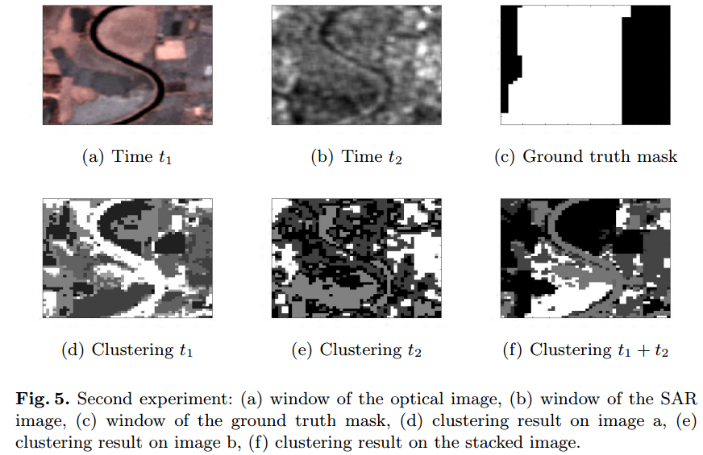
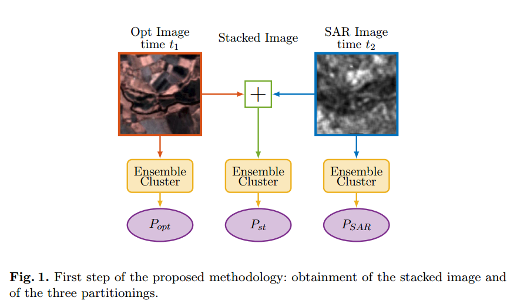

--- 
title: 17.2.19 A clustering approach to heterogeneous change detection
---

* content
{:toc}

## 动机
clustering不管咋发展，最终都是得为application服务，所以多看点application还是很好滴。

## 文章内容
### 定位
根据作者的描述，搞这个的work很少，作者只列出来四五个文献，可以说这个领域非常小众，而作者在题目中加入“A clustering approach”应该暗指，这是第一个用clustering来搞这个的文献，呵呵。
另外，作者的方法和实验都是描述性质的，显得不令人信服。

因此，这篇文章是一个“占坑”性质的paper。
哦，在conclusion的地方更明显是占坑了。
### 无监督算法的合适性
毕竟用的是无监督方法，因此算法的灵活性显然是不够的，即无法随心所欲地根据ground truth使得algorithm非常powerful。
并且作者也承认（也强调）了，能够反映image的统计特性的distance measure很重要，哈哈，结果还算选了个非常common的distance measure，这说明该问题的无奈。

作者还隐晦地指出，这种问题的ground truth很难准确得到，目测这才是作者选用clustering的一个重要原因。但clustering能否适用于这个明显需要更多推理任务的task呢？

### 具体算法
为了突出重点，咱们先看实验吧

#### 实验一

这个聚类结果还算比较明显的。
图d的上半部分一分为二，即由原来的农田变成一半农田，一半被淹的水，这个可以和t2时刻的sar image的聚类结果对比看出来，也可以在图f上半部分的浅灰和深灰部分很明显地看出来
上面是split，中间部分是merge，即图e的中间部分是由图d的中间部分的河流和农田merge而成的。

#### 实验二

这个结果就没有实验一好了，首先是聚类结果不太好，图d右下角本该聚到一块儿的都分开了，图e也类似，当然这不是聚类算法的错，是因为数据特性的事儿。
这时候直接看出来那一部分有change已经很难了。

作者指出，聚类效果差的原因sar图像中著名的speckle noise造成的，当然本实验也表明了，通过观察“cluster splits and merges”来发现change的方法严重受限于聚类结果

#### 问题描述
对于同一个区域，在 $t_1$时刻，有一个optical image，在洪水等灾害来了之后，在$t_2$我们又用另外一个类型的sensor搞出来一个sar image（当然，这个sar image还得滤波的，它会suffer from speckle noise)，我们需要根据这一对图像来找出来图像中那一块儿区域发生了变化，即灾害的影响。

因此这就是**heterogeneous change detection**，如果两个时刻的图像都是用同一类sensor得到的，那就是 homogeneous and co-calibrated measurements。

作者在intro中提到这个heterogeneous的难点：
1. 不同的sensor对不同的physical condition的敏感程度也不一样，即sensor behavior不一致，这样就可能和actual change混淆了，即这俩sensor数据的差别并非简单地表征change的存在。
2. fused data set的复杂度越高，就需要更加复杂和灵活的统计模型，当然越复杂就越难fit，因为会有更大的参数估计不确定性，以及更高的计算需求

#### 算法原理

基于一个intuition：
>cchanges on the groundchanges on the ground can be related to clusters of the image at time $t_1$ splitting and/or merging into the clusters of the image at time $t_2$.

这个intuition的确有点道理，可以在聚类结果的基础上用于推理, 当然这个推理是人肉计算，并非自动化的。也就是用人眼去观测，这不就是开了外挂么？

相较于supervised algorithm而言，无监督算法估计只能这么玩儿了？

#### 聚类算法的使用
* 首先是distance measures的选取。
首先要identify the correct statistical models to represent the data。对于optical images，$x_{opt}$ 服从高斯分布，而SAR image取对数之后也服从高斯分布，这样就使用Mahalanobis distance就行了（就是分布用的distance measure）。

* 然后是聚类算法的选取
使用Ensemble clustering来缓解聚类算法对于聚类个数、scale参数、初始化等的敏感性，当然这么玩儿计算代价就高了一些。
作者使用的是FCM的ensemble approach。

由于后边的分析直接依赖于聚类结果，因此，聚类结果必须非常reliable，当然ensemble approach并不能保证reliable，因此，作者说打算以后参照聚类的隶属度矩阵使之更reliable。

* 一个非常重要的细节被作者有意省略了
将每个图片分成 50x50 pixels的方框，然后分别对每个方框中的数据聚类，理由是，分割以后每个方框中的cluster数目就可以很少，这样有助于聚类个数的确定，以及减少计算需求。
但你这么玩儿了，咋将各个方框组合一起呢？

## 总结
作者用聚类来干这件事很显然是不合适的。
因为聚类一般只能给出一些cluster，这些cluster到底该如何使用，那就是problem dependent的。对于本文的一个应用，作者并没有develop一个可以实现的算法去应用这个聚类结果，而是直接人肉推理，当然，理想的情况下应该是，将作者的那个 merge split的intuition进行程序化、自动化。

目测作者无法完全做到自动化的原因就是，这个intuition强烈依赖于聚类算法的聚类结果，而目前聚类算法的性能都是很无奈的，主要是由于data的特性太过于复杂，还有聚类算法对于distance measure的致命性依赖。

任重而道远。