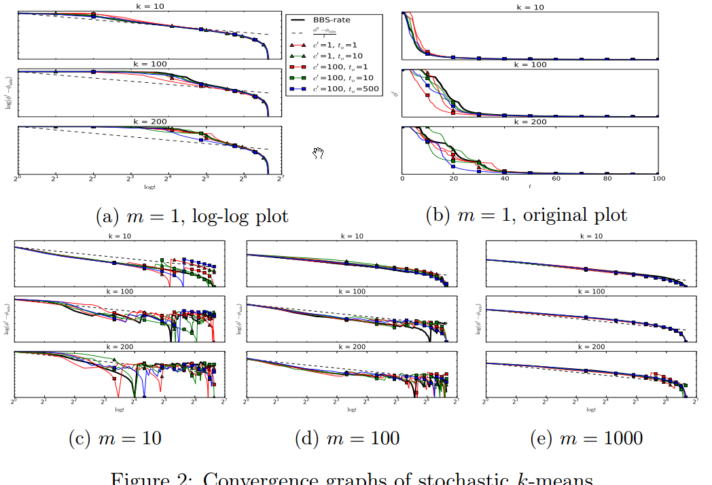

--- 
title: Convergence rate of stochastic k-means
date:   2017-03-8
---

* content
{:toc}

一篇NIPS 2016，非常理论的文章。

## 摘要

### 研究对象
__online [5] and mini-batch [16] k-means variants__
通过stochastic approximation来scale up k-means 的两大算法，现在主要用于 
_large-scale clustering and unsupervised feature learning_ 

### 研究结果
首次证明，不管从哪个 initial solution 出发，都会以 $O(\frac{1}{t})$ 收敛到一个局部最优。

还有，只要数据集是 clusterable的，在用一个 simple and scalable seeding algorithm初始化的时候，mini-batch k-means converges to an optimal k-means
solution at rate $O(\frac{1}{t})$ with high probability。

## Intro

对于在大规模数据集上的聚类，由于每一次的iteration的时间都是 $O(n)$ ,因此不太好啊。

To scale up the centroid-update phase，一个可行的recipe就是 _随机逼近_。
the overall idea is：
>at each iteration, the centroids are updated using one (online [5]) or a few (mini-batch [16]) randomly sampled points instead of the entire dataset.

本文的主要贡献就是证明了 $O(\frac{1}{t})$ global convergence of stochastic k-means。
关键思想是 _追踪当前聚类结果与所有局部最优的距离_。

就是下图表面了stochastic k-means against batch k-means on the RCV1 dataset：

这就激发了作者想要characterize the convergence rate of stochastic k-means。探究为啥有局部极值，以及mini-batch size的影响等。

## 实验部分

_数据集_：RCV1 [12]。804414 newswire stories，每一额story 都是一个47236-dimensional sparse vector。

收敛图，暂时看不懂，以后再看：
