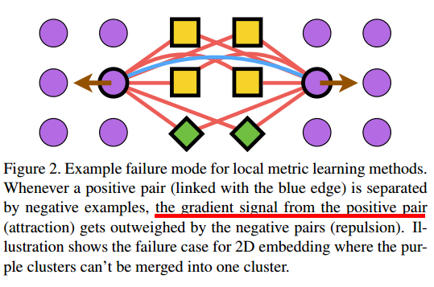
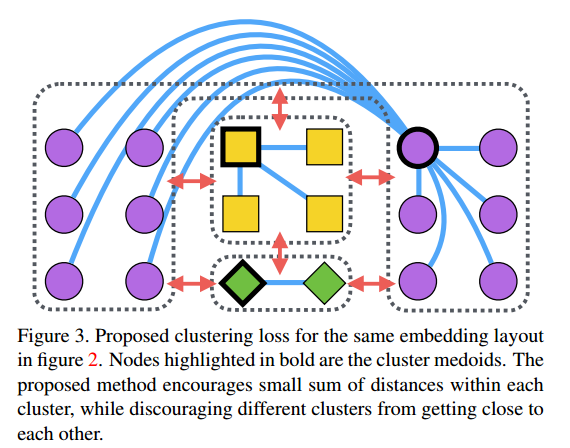
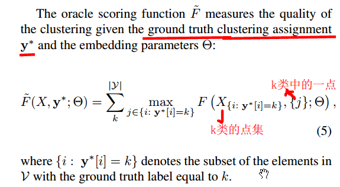
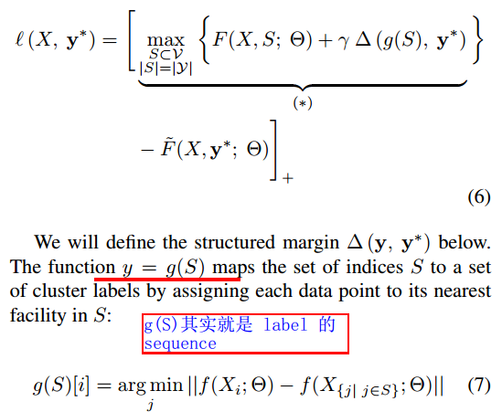
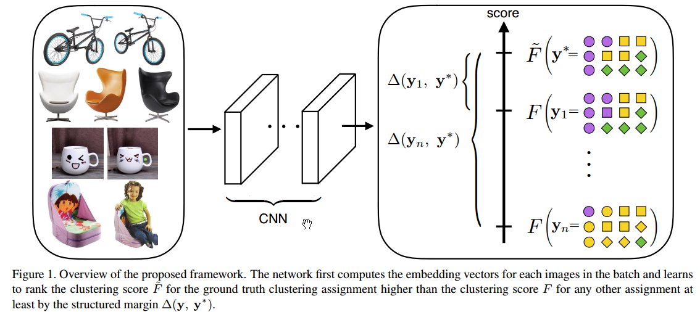
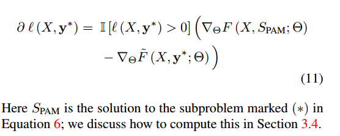
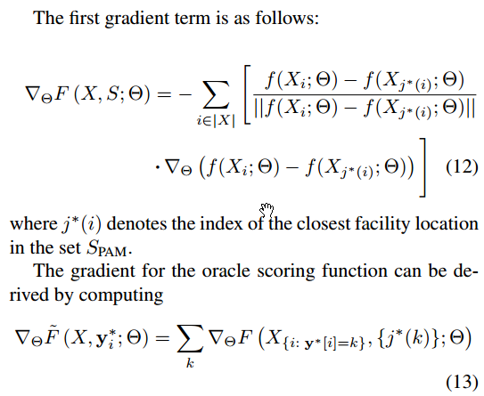
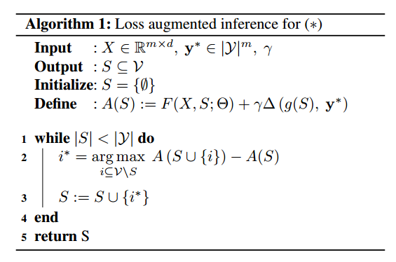
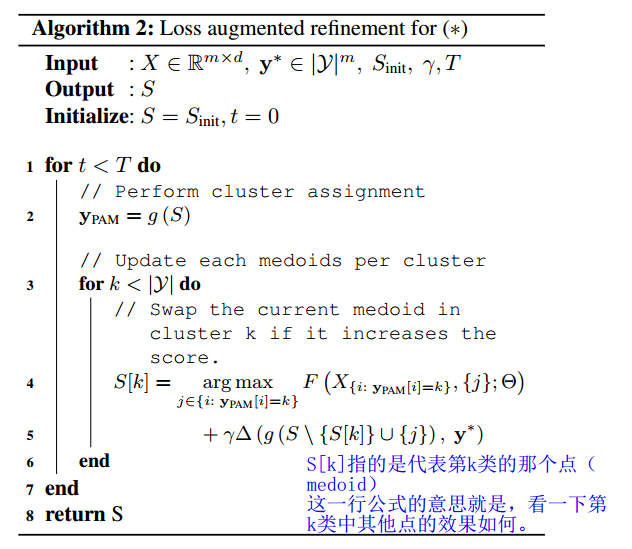

--- 
title: Learnable Structured Clustering Framework for Deep Metric Learning
date:   2017-02-27
--- 

* content
{:toc}

## 扯扯淡
这几天杂事比较多，重新装机花了我两天时间，另外自身的调节也没做好，差点又lost myself了。
好了，好好看论文，多思考。

## 前言

###  现在 metric learning 的best approaches
利用soa的NN得到一个embedding function，以最小化某种loss [19, 30, 27, 9]，

作者钦定它们 __无法考虑 global structure of the embedding space，因为它们的loss 都是定义成 training mini-batch 中的 pairs or triplets__

作者不用这些pairs or triplets，因此 _作者的 algorithm is aware of the global landscape of the embedding space_。

###  以下是作者的work，其中第二点是技能树
1. 我们要学习到一个 _直接优化距离指标NMI_ 的embedding function
2. 使用 _structured prediction framework [34, 14]_ 来确保 _ground truth clustering assignment的score 高于 其他的clustering assignment_
3. 搞了三个数据集： _CUB200-2011 [36], Cars196 [18], and Stanford online products [29] datasets_ for clustering and retrieval tasks.

## 总览
* 干了啥：搞了一个新的学习方案，优化 deep metric embedding with the learnable clustering function and the clustering metric (NMI) in a end-to-end fashion
within a principled structured prediction framework
* 定位：这篇文章可以说就是设计loss的。
在3.2节结束的地方，作者提到这个loss的特殊之处： __小的类内variance，同时类间隔足够远（通过NMI  metric项实现）__
* 作者的卖点
    1. 声称：the algorithm is aware of the global landscape of the embedding space。
    2. 和三个soa的算法比起来，不需要将数据准备成pairs
不过我还没看明白咋实现的，这东西隐含在loss的形式中了，得好好看啊。

看到实验细节部分，就是用Tensorflow搞几个式子嘛。 即便是端到端的，图像的各种初级预处理也得有，如都crop成 227 × 227。

##  Related work
在 deep metric learning 的seminal work [8, 4] 中，最小化类内pairwise distance，最大化类间pairwise distance。
但它用的是绝对距离，而作者说对于大多数任务，__relative distances matter more.__ 
因此好多不同的 __损失函数__ 搞出来了。

作者重点提到一篇 _CVPR, 2016，Deep metric learning via lifted structured feature embedding_，它将所有的 _negative pair_ 都比较一下。
[Github代码](https://github.com/rksltnl/Deep-Metric-Learning-CVPR16)
__这一篇一定要看一下。__

__还提到两篇clustering的__：
1. [10] J. R. Hershey, Z. Chen, J. L. Roux, and S. Watanabe. Deep
clustering: Discriminative embeddings for segmentation and
separation. In ICASSP, 2016.  它用的是Frobenius norm，缺点是suboptimal, since it ignores the fact that the affinity matrix is positive definite.
2. 为了克服上面的那个缺点，matrix backpropagation _Training deep networks with structured layers by matrix backpropagation. In ICCV, 2015._
将 __affinity matrix 投射到 a metric space where Euclidean distance is ppropriate__

## 作者的方法

### general outline
两个图镇楼：

在图二中，橙色的positive pair被其他类的 example隔开了。
__the attractive gradient signal from the positive pair gets outweighed by the repulsive gradient signal from the negative data points (yellow and green data points connected with the red edges).__
因此同一类内的example在embedding space中有可能离得很远。

在图三中，加粗的几个点是聚类中心，由于本文的算法 _learns to embed points so as to minimize a clustering loss_ ，因此类内variance尽量小，类间距尽量大。

作者根据这俩图钦定了：
>the algorithm is aware of the global landscape
of the embedding space, it can overcome the bad local optima in figure 2

### facility location problem
在已知 inputs $X_i$ 和 an embedding function $f(X_i;\Theta)$  (将 $X_i$ 映射到一个 $K$ dimensional space）的情况下，根据 landmark 对这些点进行压缩，别看公式核名称那么玄乎，其实就是 _单个类的类内variance_，即每个点与最近邻的距离之和。

$$F(X, S; \Theta) = -\sum_{i \in |X|} \min_{j \in S} ||f(X_i; \Theta) - f(X_j; \Theta)||,
\label{eqn:facility}$$

其中 landmarks
$S \subseteq \mathcal{V}$,， $\mathcal{V}  = \{1, \ldots, |X|\}$ is the ground set。

__注意__ :
1. 这个facility location problem 用作整个 deep metric learning 的一个环节。
2. 最大化 $F$ 其实就是最小化类内variance。

### Structured facility location for deep metric learning
作者搞出来一个oracle scoring function，用于测度已知 _真实类标_ 和 _embedding参数_ 时候的 _clustering quality_。

这个东西就是所有类的 _类内variance_ 之和。

在前言中，作者提到 _structured prediction framework _ 能确保 _ground truth clustering assignment的score 高于 其他的clustering assignment_ 

现在我们的 _需求_ 是，要确保不太好的 clustering assignment 的score 距离 oracle 的很远，当然我们期望的 predicted clustering assignment 的score 要距离 oracle的近一些，因此设计 _structured loss function_ 如下：

作者钦定这个loss的功能如下：
> oracle clustering score $\tilde{F}$ is greater than the  至少比其他 cluster assignments $g(S)$ 的 clustering score $F$ 大一个 structured margin $\Delta\left(\mathbf{y}, ~\mathbf{y}^*\right)$.

如果真是这样的话，公式6就得这么理解：这个式子必须得是正的。

好了，整体框图如下：

###  Backpropagation subgradients
NN的训练离不了SGD，那么关键步骤就是6式的derivative了：

其它两项很好算：

下面就是如何求解6式了。

### Loss augmented inference
由于第一项 $F(X,S; \Theta)$, is a monotone submodular function in $S$，并且第二项，即 margin term 相比第一项来说很小，故这俩的和依然很接近 submodular， 因此可以用 greedy Algorithm 1 来解。 

而且有文献表明，对于approximately submodular functions, the greedy algorithm效果也不错。

__注意：这里要求真实类标是已知的！__

对于算法1的解释：
>In each step, it chooses the element $i^*$ with the best marginal benefit. 

啥意思？就是说，每次我们都要找到一个点，使得marginal 的增量最大（其实不仅仅是marginal 增量）。

当然，由于 $A(S)$ is not entirely submodular，还可以将这个 greedy solution 用 local search 给 refine 一下。
这个算法跟 _partition around medoids (PAM) [15] algorithm for k-medoids clustering_ 很像，其实就是将当前的聚类中心替换为该类的其他点，然后找到增量最大的点。

### Implementation details
计算loss的时候对embedding vectors 进行 $\ell_2$ normalization

算法二可以用随机初始化，也可以用算法1初始化，后者效果好一点。

网络结构细节：
>Inception
[31] network with batch normalization [11] pretrained on
ILSVRC 2012-CLS [23] and finetuned the network on our
datasets. 

有文献表明  embedding size 对于实验效果影响不大，因此将其固定为 64. 即64维。

其他参数：
>We used RMSprop [32] optimizer with the batch size m set to 128.
For the margin multiplier constant γ, we gradually decrease
it using exponential decay with the decay rate set to 0:94

## 感受和总结
### 感受
上周处于各种调整期，又重装系统，因此花了将近一周的时间才将其看完。

当时看的时候对这个领域很陌生，原因就是很多common的东西不知道，如这个圈子咋玩儿的，一般都有哪些方法，deep learning 的轮子不熟悉等。

现在回过头来看，发现也就那样，都是在现成的框架里跳舞。 
embedding function的学习其实就是学习一个映射，再用NN的paradigm就是用SGD等学习一堆NN参数。 好了，NN的梯度从哪儿来？你就得设计一个好的loss了，这个loss就反映了你的问题的characteristic，这个loss形式的好坏indicate了NN能否从你的loss中得到足够有用的information，进而学习到好的embedding function。

### 总结
这篇文章应该作为一个引子，进入这个领域。
它的试验中提到三个soa，其中一个我发现有github的代码。
这篇文章提到好多cvpr，iccv等的文献，都可以看一下。
这些文献说明作者的积累。

好好干吧，:frog: