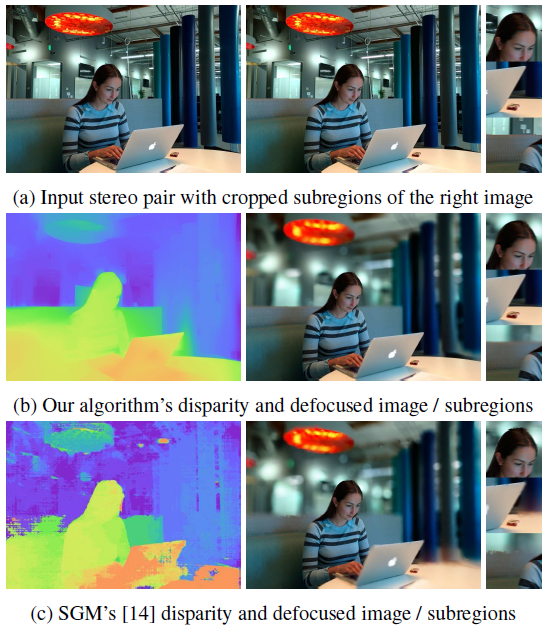
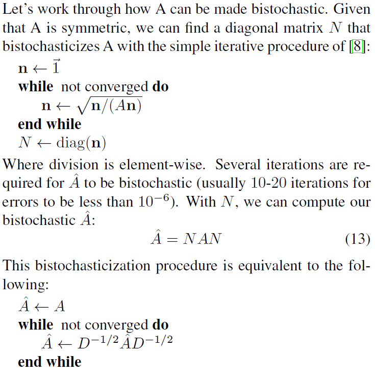

--- 
title: Fast bilateral-space stereo for synthetic defocus
date:   2017-4-13
---


* content
{:toc}
## Insight
### 目标函数中利用矩阵的分解
splat matrix很简单，就是每个vertex对应的pixel的indicator matrix，单独这么看的话，这个矩阵就没啥意思了 （我指的是，直接把这个矩阵和image相乘，得到的bilaterial space中的格点就是该格点对应的像素的rgbxy等值的和，这能有啥意思？），作者将这个矩阵作为bilateral filtering的分解成份之一，也就是作为bilateral filtering的滤波矩阵 $A$ 的成份，嵌入到目标函数中，将  $A$  这个仿射矩阵当做平滑性的约束，进而将 splat matrix 的特性加以利用 将bilateral space中的loss构建为pixel空间的loss的加权和，同时这个splat matrix也用到了将平滑性目标函数变换到bilateral的重任。

### 逼近的思想。要这么想，很多问题都会豁然开朗。
我们的目标函数本来就是一种逼近，也就不在乎，在目标函数从pixel space到bilateral space变换的过程中再加一层逼近了，只要大方向大差不差就行了。
如$p^T(I-\hat{A})p$ 到 $C_i-C_d\bar{B}C_d$的转化，我们先利用已经bistochastic之后的\hat{A}将平滑项$\frac{1}{2}\sum_i\sum_j\hat{A}_{i,j}(p_i-p_j)^2$变成$p^T(I-\hat{A})p$,然后注意到，此时继续利用\hat{A}的分解可以得到$v^T(C_i -C^{'}_N\bar{B}C^{'}_N)v$, 由于我们是在bilateral space对 $A$ 进行bistochastic的，注意看，最后这个式子是 $v^T(C_i -C^{'}_N\bar{B}C^{'}_N)v$，$v$在最外边了，括号里边可以认为是 $A$ 在bilateral space进行 bistochastic的结果，因此可以直接用 $C_i-C_d\bar{B}C_d$ 来逼近 $C^{'}_N\bar{B}C^{'}_N$。

## 写在前面
我几乎没有深入过cv的文章，更何况是特定于某一个子领域的文章了，因此看的很吃力。
这篇文章我看了大约一个月，写个笔记总结一下吧。

看的慢的另一个原因是，这篇文章并无官方代码，而是 [这里fast_bilateral_space_stereo](https://github.com/tvandenzegel/fast_bilateral_space_stereo) 提供的，而且是c++的，对于只知道c++ 的class用法，没有用过STL的人来说，适应这些高级用法还是需要很长时间的，另外很长时间用于看ceres优化库的用法了。

当时下决心啃这篇文章的原因是，它通过一个简单的目标函数，一个简单的升维（美其名曰bilateral space，其实就是将 $(rgb,x,y)$ 这几个维度一块儿考虑）就能hold住一个复杂的问题。

## 摘要
研究stero algorithms，用于产生defocused renderings.

本文提出了一个产生深度图（disparity maps)的技巧，在这个optimization framework中，在"bilateral-space"进行inference。 （大白话就是：优化的变量是"bilateral-space"的组成单元，即grid）。

## 基础知识
算法输入是一对摄像头拍出来的同一个场景的两张照片（双摄）。
算法输出是其中一个照片，其每一个点的“像素值”即disparity value，这个disparity和我们所理解的深度图有啥关系呢？

首先下个定义：
>对于左边图像的每一个像素，我们要找到其在右边frame的match，然后计算它们俩的距离，我们就能得到 an image where every pixel contained the distance/disparity value for that pixel in the left image.

在 [Difference between Disparity map and Disparity Image in Stereo Matching]
(https://stackoverflow.com/questions/17607312/difference-between-disparity-map-and-disparity-image-in-stereo-matching)中，有个答案提到，要想理解 disparity，可以想象一下眨眼的情形，每次只眨一只眼，两眼交替，你就会发现，离你较近的物体的position（即你眼中的像）变化的比远处的快，This shift is would be negligible as the objects move away.
Therefore, in the disparity map, the brighter shades represent more shift and lesser distance from the point of view (camera). The darker shades represent lesser shift and therefore greater distance from the camera.

## Intro
###  得到深度图的目的是实现defocus效果，因此可以牺牲深度估计的accuracy
对于同一个subject的两张图片，用stereo技术估计一个per-pixel disparity map，然后用它来渲染（render） defocused shallow-depth-of-field images。

已经有好多stereo算法了，它们一般能产生accurate depth estimates，可以用于robot navigation等任务，而defocus任务还需要localization,即深度图里的edge必须和image中的edge一致
本文的算法在accuracy上比不上传统算法（因此在Middlebury, kitti等数据集上效果没那么好)，但由于使用bilateral filtering,得以保持了edge，因此更适合defocus task。（这个可以从论文的图1中看出来）。



###  本文的technique的core idea
不同于大多数stereo 算法work by assigning a disparity label to each pixel in an image，本文利用fast bilateral filtering 来avoid per-pixel inference，也就是将一个pixel空间的a dense stereo problem __重采样到 a much smaller “bilateral-space”__，这样，small, simple blurs between adjacent vertices in bilateral-space are equivalent to large, edge-aware blurs in pixel-space. 注意啊，对新空间的元素做的局部操作等价于原空间的全局操作。

正因为inference是在这么一个compact “bilateral-space” instead of pixel-space，本文的approach才是 __fast and scalable__， 尽管我们的优化问题有non-local smoothness priors.

### 优化的是啥：理解重采样到bilateral  space的关键
这里我们要提醒一下，在原pixel space干活的话，我们要求的是per-pixel的disparity，即每一个像素对应的深度值。 本文将pixel空间进行重采样，得到grid格点，问题转化为求每一个grid的深度值（disparity value)，然后将这些grid的disparity值做一个线性变换，就得到了每一个pixel的深度值。

### 本文technique的特性
1. 将edge-aware filtering 应用在stereo中也就有很多啦，本文的不同在于，不是在pixel空间优化，而是在bilateral空间优化。
1. 大多stereo技术关注于local technique，本文的technique是global的，即solve an optimization problem with respect to every pixel。
1. 即使对于某些global stereo techniques 来说，本文的优化问题是convex，这样就能很容易地优化并保证收敛了。

## Fast Bilateral Filtering
### Bilateral Filtering简介
根据[维基百科的介绍](https://en.wikipedia.org/wiki/Bilateral_filter)，
$$I^{\text{filtered}}(x)={\frac {1}{W_{p}}}\sum _{x_{i}\in \Omega }I(x_{i})f_{r}(\|I(x_{i})-I(x)\|)g_{s}(\|x_{i}-x\|)$$

其中归一化项为：
$$W_{p}=\sum _{x_{i}\in \Omega }{f_{r}(\|I(x_{i})-I(x)\|)g_{s}(\|x_{i}-x\|)}$$
它用来保证filter preserves energe.
其他具体的符号说明详见上面的维基链接。

这个式子怎么理解呢？
左边是滤波后的图像 $I^{\text{filtered}}$ 在坐标 $x$ 处的值，$\Omega$  is the window centered in $x$， 这个就是关键了，我们只考虑目标点 $x$ 邻域的点对滤波后的 $x$ 处的像素值 $I(x)$ 进行贡献，再联想到 $f_r$ 和 $g_{s}$ 分别表示intensity和coordinate的差异，也就是同时考虑了 spatial closeness and the intensity difference。

更具体地：
我们想要对 $(i,j)$ 处的点进行滤波(denoise)，那么它邻域的 $(k, l)$ 处的像素点对  $(i,j)$ 的权值就是
$$w(i,j,k,l)=\exp \left(-{\frac {(i-k)^{2}+(j-l)^{2}}{2\sigma _{d}^{2}}}-{\frac {\|I(i,j)-I(k,l)\|^{2}}{2\sigma _{r}^{2}}}\right) \tag{0}$$

最终式子：
$$I_{D}(i,j)={\frac {\sum _{k,l}I(k,l)w(i,j,k,l)}{\sum _{k,l}w(i,j,k,l)}}$$。

好了，我们再换个更上层的角度理解一下Fast Bilateral Filtering，然后将其reformulate。

我们可以理解为每一个目标输出， 即 $(i,j)$ 处的点，是由原图像的所有点加权得到的，只是邻域内的权值不为零，邻域外的为0。
为了方便，我们将二维图像拉成一个一维矢量 $x$, 就得到了：
$$y=(Ax)/(Ax) \tag{1}$$
其中，$/$ element-wise division.

### 通过构造系数矩阵，逼近矩阵 A, 进行加速

虽然矩阵乘法很快，但挡不住 $x$ 很长（几兆的像素）的时候变慢啊，咋办？

有很多加速bilateral filtering的方法，其中倆就是：
1. the bilateral grid 
2. the permutohedral lattice

它俩都有“splat/blur/slice”过程，大概就是将pixel value splate到一些vertice上，对这些vertice进行blur，然后将这些滤波后的值slice到pixel空间。
本文声称，为了方便， 我们可以用 __矩阵分解__ 将 $A$ 进行逼近:
$$A \approx S^T\bar{B} S$$

讲到这里，作者并没有明说这个 $A$ 怎么分解，而是在补充材料的第三页，也就是讲 $A$ 是怎么 bistochastic的时候，提到 we never explicitly compute $A$。 

如果知道了上面式子0中的 $\sigma _{d}$ 和 $\sigma _{r}$, 那么就可以得到  $A$。 
既然作者说并不会显示计算 $A$，那么我们也就避免了手动去设定  $\sigma _{d}$ 和 $\sigma _{r}$。
显然，我们要手动构造splat矩阵  $S$ 和 blur 矩阵 $\bar{B}$。

既然是自己去构造这俩矩阵，我们就可以指定它俩的特性，如稀疏性，以便于计算。 
>Even though $A$ may be large and dense, by construction $S$ is a short, wide, and sparse matrix, and $\bar{B}$ is small and sparse. $\bar{B}$ is actually a product of several sparse matrices (though we will treat it as a single matrix for convenience).

ok， 现在式子1变成了：
$$y=(S^T (\bar{B}  (Sx)))/(S^T (\bar{B}  (SI))) $$
这里很明显看出来slice矩阵就是 $S^T$.
作者声称often intractably slow的式子1现在就很快啦。

bilateral representation为啥这么有efficiency？作者给出的几个factor：
1. splat矩阵  $S$ 和 blur 矩阵 $\bar{B} 的稀疏性
2. verticesum远远小于pixel的数目。在这么一个非常compact的bilateral space中解一个凸优化问题，当然很efficient了。

### grid的关键操作 简介
在 
>J. Chen, S. Paris, and F. Durand, “Real-time Edge-aware Image Processing with the Bilateral Grid,” in ACM SIGGRAPH 2007 Papers, New York, NY, USA, 2007.

中，作者提到了bilat grid的基本用法，其实主要是grid creation的过程，为了理解方便，我们不用上面这个2007的文章的notation了，主要思想是，假如我们设定了 $\sigma_{rgb}=8$  $\sigma_{xy}=32$, 那么我们就在 $([x/32],[y/32],[r/8],[g/8],[b/8])$ 处新建一个grid。
建立了grid我们怎么处理呢，貌似随便一个函数就能把旧grid变成新grid，而对于我们的bilateral filter来说，这个函数就是一个高斯核的卷积。
将grid处理完之后，就需要slice了，它负责产生 __piecewise-smooth output__.

## Problem Formulation  初步的目标函数
我们要求每一个pixel的disparity $p_i$， 然后再对  $p_i$ 施加一个smoothness的限制。
$$\min_p\{\frac{1}{2}\sum_i\sum_j\hat{A}_{i,j}(p_i-p_j)^2+\lambda\sum_if_i(p_i)\}  \tag{2}$$

有a smoothness term（前项） and a data term（后项）。
作者提到，论文
>[20] P. Milanfar. Symmetrizing smoothing filters. SIAM J. Imag-
ing Sci.,2013

声称，当用作filter的时候，为了易于操作、拥有期望的性质，我们需要将affinity矩阵进行bistochastic化，即这个矩阵的row或column的和必须为1.
因此上面的2式用的是仿射矩阵 $A$ 的bistochastic版本 $\hat{A}$.

## 平滑项
###  将平滑项初步转换到bilateral space
对于平滑项 $$\frac{1}{2}\sum_i\sum_j\hat{A}_{i,j}(p_i-p_j)^2$$ , 像素i,j直接的仿射性 $\hat{A}_{i,j}$ 越强（即数值越大），就会迫使可行解 $p_i$  与 $p_j$ 的差异越小。

显然：
$$\sum_i\sum_j\hat{A}_{i,j}p_i^2= \sum_ip_i^2\sum_j\hat{A}_{i,j}=(p_1^2+\dots+p_n^2)\hat{A}I$$
$$\sum_i\sum_j\hat{A}_{i,j}p_j^2= \sum_jp_j^2\sum_i\hat{A}_{i,j}=(p_1^2+\dots+p_n^2)\hat{A}I$$
$$-\sum_i\sum_j\hat{A}_{i,j}p_ip_j=-p^T\hat{A}p$$
故，
$$\frac{1}{2}\sum_i\sum_j\hat{A}_{i,j}(p_i-p_j)^2=(p_1^2+\dots+p_n^2)\hat{A}I=p^TIp$$
平滑项为：
$$p^T(I-\hat{A})p$$

对于cost项，$\sum_if_i(p_i)$ 比较麻烦，这个东西是problem specific的，后面再看。

好了，现在回到平滑项，回忆一下 $A$ 的分解：
$$A \approx S^T\bar{B} S$$

我们要用这个矩阵分解做一个变量替换，这样我们的优化变量就从像素的 disparity 值 p 变成了 格点 (grid 或 bilateral space vertex)的disparity值 $v$
$$p=S^Tv$$
由于格点数远低于像素数，因此就降维了。求得 $v^{optimal}$ 就求得了 $p^{optimal}=S^Tv^{optimal}$.

好了，由于  $p^{optimal}=S^Tv^{optimal}$，并且 $v$ 的长度远小于 $v$ 的长度， $p^{optimal}$ 所在空间的维度顶多和 $v^{optimal}$ 的一样（因为这俩空间是线性变换的关系嘛）。
换言之，并不是所有的solution都是expressible，每一个pixel的disparity都是bilateral space vertice的插值函数（也就是slice啦），这样我们的output space就会有严重的constraint了。

### 平滑项的初步理解
另外，我们的深度图必须得smooth（in a bilateral sense), 这个bilateral sense是啥呢，就是说我们必须得平滑，不平滑的地方也得符合bilateral的基本法，即只有输入图像有edge的地方才允许不平滑。 （还有这么一层简单的逻辑关系：既然是插值，很明显地，我们的output disparity（ pixel的深度图上）有sharp edge的时候，必须要求在bilateral的格点上也有edge，进而要求，input image上也有edge.）

以上表明，我们的深度图必须得resemble 一个bilateral filter 的输出。

再来看平滑项：$$p^T(I-\hat{A})p$$
我们的目标是把 $p$ 换成 $S^Tv$, 顺便把 $A$ 干掉。
假设我们已经求出了矩阵 $A$ 的归一化矩阵 $N$ (附录里有具体步骤）.
>在A Symmetry Preserving Algorithm for Matrix Scaling. SIAM. J. Matrix Anal. & Appl, 2014. 中提到了迭代法求归一化矩阵。
对于一个对称阵 $A$,可以找到一个对角阵 $N$，将其bistochasticize。


$$p^T(I-\hat{A})p=(S^Tv)^T(I-NAN)(S^Tv)=v^T(SS^T-SNANS^T)v=v^T(SS^T-SNS^T\bar{B}SNS^T)v$$

简化一下记号：
$$v^T(SS^T-SNS^T\bar{B}SNS^T)v=v^T(C^{'}_S -C^{'}_N\bar{B}C^{'}_N)v$$

### 进一步加速 用对角阵代替半稀疏矩阵
按理说到这没啥问题，但作者意识到这地方可能会很慢，因此又多了个插曲。
上面倆 $C^{'}$ 矩阵隐藏了一个严重问题。也就是，splat matrix的外积（就是矩阵乘法啦）并不是特别sparse，计算过程需要很expensive的sparse-sparse的矩阵乘法。
作者提议，__应该用对角阵代替这些 semi-sparse matrtice__, 并且一个非常cheaply地估计这些对角阵。
因为上面这个issue牵涉到bistochasticization矩阵， 因此bistochasticization密切相关。
要想把上面这个issue避免掉，可以从计算bistochasticization矩阵的时候就考虑到这个问题。
咋考虑？

回忆一下，上面的计算过程为：构造bilateral仿射矩阵 $A$, 在pixel-space将其bistochasticized，然后通过投影bistochasticization矩阵 $N$ 到vertex space得到 $C^{'}$ 矩阵。

如果我们能利用 $A$ 的结构，并将其在bilateral space中进行bistochasticize，同时只用对角的 $C$ 矩阵，那么肯定就会更快啦。
当然这只是一种逼近，$A$ 的分解是逼近的。另外， $C$ 矩阵也是用对角阵来逼近的，这就意味着我们没有model splat/slice 矩阵的mixing （不理解这句话），因此我们的仿射矩阵没有那么strong，也就是说，一个精确的 $A$ 可以迫使得到的深度图是光滑的，我们现在逼近了这么多，此时的 $A$ 就没法让得到的深度图那么smooth了。

那么怎么在bilateral space中进行bistochasticize呢？
由于 $A \approx S^T\bar{B} S$ , 那么直接bistochasticize $\bar{B}$ 不就行了？
别急，由于每一个vertex的pixel的数目不一致，因此，需要将 $\bar{B}$ 除以 各个 vertex 的pixel的数目 （即该vertex的mass）。

注意，我们的仿射矩阵 $A$ 不是通过指定 $\sigma_{d}$ 和 $\sigma_{r}$ 计算得到的, 而是要手动构造splat矩阵  $S$ 和 blur 矩阵 $\bar{B}$。
那么   $S$ 是啥样？
维度是 $n_{vertex}\times n_{pixel}$, 也就是对于每一行，该列的元素只有0或1,1代表该列对应的pixel属于该行的vertex。
因此每一个vertex对应的pixel的数目就是： $m=SI$.
（另外，$\bar{B}$ 的维度是：  $n_{vertex}\times n_{vertex}$  )

好了，下面介绍一下，如何得到一个归一化的matrix $\bar{B}$, 这个归一化和前面的有一点点差别，即行和列加起来都是 $m$.

咋理解？
我们现在归一化的是 $\bar{B}/m$, 因此得到的 归一化矩阵 $C_d=diag(n)$， 满足 $C_d\frac{\bar{B}}{m}C_d=I$, 即 $C_d\bar{B}C_d=m$
注意，这里得到的 $n$ 并不是真正将 $\bar{B}$ 给bistochasticize，而是在bilateral space中隐式地将 $hat{A}$ 进行bistochasticize。
有了  $n$ ，就能构建一个新的轻量版的 $C$ 来代替 $C^{`}$.

$$C_d=diag(n), C_i=diag(m)$$

这样我们的计算就很cheap了。

>这么做为啥可行（make sense)？
观察到：
$$(C^{'}_d\bar{B}C^{'}_d)I=m=(C_d\bar{B}C_d)I$$
因此， $(C_d\bar{B}C_d)$  是 $(C^{'}_d\bar{B}C^{'}_d)$ 的一个reasonable的逼近。

上面这一段引用我并没有完全搞懂，因为作者并没有在任何地方提到过 $C^{'}_d$。
至于 $m=(C_d\bar{B}C_d)I$ 则很容易理解，因为 $C_d$ 就是这么构造的，就是要让 $C_d\frac{\bar{B}}{m}C_d=I$。

### 这些逼近如何去理解
上面这一坨太乱了。细细捋一下吧。
从$\frac{1}{2}\sum_i\sum_j\hat{A}_{i,j}(p_i-p_j)^2$ 到 $p^T(I-\hat{A})p$ 利用了 $\hat{A}$ 的 bistochastiction 特性。
显然，如果我们不是bistochastic 矩阵 $A$, 而是在这一步就用bistochastic $\bar{B}$, 即 $\hat{B}=C_d\bar{B}C_d)$, 那么显然是无法走到$p^T(I-\hat{A})p$ 这一步的。
因此首选采用bistochastic后的矩阵 $A$， 即 $\hat{A}$ 保证走到 $p^T(I-\hat{A})p$ 这一步。

而我们为了计算方便，采用在bilateral space对  $A$ 进行 bistochastic，也就是 再一次进行逼近 $\hat{A}\approx S^T\hat{B}S$, 但显然并不是$\hat{A}\approx S^T\hat{B}S$这个式子那么简单，因为我代进去之后发现怎么都没法推出来下式：
$$p^T(I-\hat{A})p=v^T(SS^T-SNS^T\bar{B}SNS^T)v=v^T(C^{'}_S -C^{'}_N\bar{B}C^{'}_N)v=v^T(C_i -C^{'}_N\bar{B}C^{'}_N)v=v^T(C_i -C_d\bar{B}C_d)v$$

因为最后一步 $v^T(C_i -C^{'}_N\bar{B}C^{'}_N)v=v^T(C_i -C_d\bar{B}C_d)v$ 很难成立。

我感觉唯一的能够make sense的理解角度就是一直逼近了，即，既然 $p^T(I-\hat{A})p$ 最后可以变成 $v^T(C_i -C^{'}_N\bar{B}C^{'}_N)v$, 由于我们是在bilateral space对 $A$ 进行bistochastic的，注意看，最后这个式子是 $v^T(C_i -C^{'}_N\bar{B}C^{'}_N)v$，$v$在最外边了，括号里边可以认为是 $A$ 在bilateral space进行 bistochastic的结果，因此可以直接用 $C_i-C_d\bar{B}C_d$ 来逼近 $C^{'}_N\bar{B}C^{'}_N$.
这个推理虽然很弱，不过既然是逼近，应该可以接受？
论文里根本没提这个逼近的效果，只是用了，连解释都没有，只能这么猜了。

### 理解平滑项逼近的另一个角度
平滑项只要起到平滑作用就行了，没必要多精确，怎么计算方便怎么来

##  data项 也就是loss啦
### 确定loss的形式
既然平滑项都被我们 formulate 到bilateral space了，还有一项 data term作为我们的 per-pixel 优化问题需要变到 bilateral space。


注意到，在pixel space，我们的loss是一个 per-pixel 的函数 $\sum_if_i(p_i)$，为了保证优化问题对我们的解 $p$ 是连续的， 我们假设 这个 $f_i(p_i)$ 是一个查找表(lokup table)，并且使用线性插值来access。

如果要将这loss 搞到bilateral space，咋搞？
将这个per-pixel lookup table splate成bilateral space lookup table.

回忆一下， splate matrix $S$ 的每一行就是 vertex $v_j$ 所对应的pixel，也就是如果对应的pixel属于这个vertex，那么该 column就为1.

现在，我们根据 $S$ 的这个特性对loss扩展一下，对于这个vertex的disparity $x$, 我们定义 $x$ 的vertex function 为该vertex的所有pixel的function之加权和。


目测，在本文中，这些权值 $w$ 都是1.
__这个定义其实很好理解__，既然我们的splate matrix $S$ 的每一行就是 vertex $v_j$ 所对应的pixel，而且splate matrix的的作用是将pixel space变到bilateral空间

好了，我们先不管 $g_j(v_j)$ 或 $g_j(x)$ （这俩同一个意思） 的具体形式，把美好的、在bilateral-space的优化问题写出来：


$$\min_v\{v^T(C_i-C_d\bar{B}C_d)v+\lambda\sum_jg_j(v_j)\}$$

这里要继续提醒一下，我们的原问题 $\min_p\{\frac{1}{2}\sum_i\sum_j\hat{A}_{i,j}(p_i-p_j)^2+\lambda\sum_if_i(p_i)\}$, 优化变量是 per-pixel disparity $p$，这个 $p$ 是像素空间的，维度是所有像素的个数，现在变到bilateral space之后，优化变量是 per-vertex disparity $p$, 顾名思义，我们要求的变成了每一个vertex的 disparity $p$.

### 一个有效的计算方法   双重积分
对于本文的framework，我们只需要保证loss那一项，即 $f_i(p_i)$ 是一个凸的查找表就行了。

作者说，一个简单的选择就是，sum-of-absolute-values，然后将它splat到bilateral框架，但这么搞的话，太inefficient了，即，需要一个 $N\times D$ 大小的空间寸这个cost，而且需要 $D$ 个splat操作，这里 $N$ 表示pixel的数目，$D$表示vertex的数目，slow and memory-intensive.
作者为此搞了一个particular data term，它能够保持凸性， 并且允许 bilateral-space cost volume 能够在时间和空间上都是 $O(N)$ 的复杂度。


per-pixel cost:
$$f_i(p_i)=\max(0,p_i-u_i)+\max(0,l_i-p_i)$$
其中 $l_i$ 和 $u_i$ 分别是像素 $p_i$ 对应的 disparity的极小和极大值，这俩值是直接从输入的倆图像中估计出来的，用的是 Birchfield-Tomasi 的包络法。

这个loss惩罚的是那些 处于 $[l_i,u_i]$ 之外的  $p_i$。
对于每一个pixel，这俩hinge-loss的和就是这个loss啦。

另外，这个loss是其他更好的（more descriptive）的loss 如 sum of absolute difference 的loss的一个粗略逼近。

那么怎么才能embed到bilateral space中呢？
由于hinge loss的微分是 Heaviside function, Heaviside function 的微分是delta function，所以使用delta function __进行两次积分就行了__。

### data loss 的部分代码
在[这里](https://github.com/tvandenzegel/fast_bilateral_space_stereo)的代码中，明确给出了， 图像0中的点x和图像1总的点(x+d)是否match的判定：

```cpp
block_match_image.data[idx] =
                        (stereo_images_upper[0].data[idx] >= stereo_images_lower[1].data[idx + d])
                        &&
                        (stereo_images_lower[0].data[idx] <= stereo_images_upper[1].data[idx + d]);
```
这个就是附录里提到的Birchfield-Tomasi方法（一部分），其中 `stereo_images_lower` 和 `stereo_images_upper`就是包络啦（通过腐蚀和扩张操作得到）。

然后更新max_disp_image
```cpp
for (int i = 0; i < width * height; ++i)
        {
            if (block_match_image_final.data[i])
            {
                if (min_disp_image.at<int16_t>(i) == std::numeric_limits<int16_t>::max())
                {
                    min_disp_image.at<int16_t>(i) = std::min(min_disp_image.at<int16_t>(i), (int16_t)d);
                }

                max_disp_image.at<int16_t>(i) = std::max(max_disp_image.at<int16_t>(i), (int16_t)d);
            }
        }

```

以上是针对每一个d进行搜索的。


在generate_data_loss_table的时候，用了下面这些代码：
```cpp
lookup.clear();
    lookup.resize(nb_vertices * disparity_range, 0);

    for (int vertex_id = 0, vertex_id_end = nb_vertices; vertex_id < vertex_id_end; ++vertex_id)
    {
        int counter = 0;
        int* plookup = &lookup[vertex_id * disparity_range];
        for (Eigen::SparseMatrix<float, Eigen::RowMajor>::InnerIterator it(grid.get_splat_matrix(), vertex_id); it; ++it) // loop through pixels of that vertex
        {
            const int pixel_id = it.index();
            const int pixel_weight = static_cast<int>(it.value());

            int gj = 0;
            for (int j = max_disp_image.at<int16_t>(pixel_id) + 1 - disparity_min; j < disparity_range; ++j)
            {
                gj += pixel_weight;
                plookup[j] += gj;
            }

            gj = 0;
            for (int j = (int)min_disp_image.at<int16_t>(pixel_id) - 1 - disparity_min; j >= 0; --j)
            {
                gj += pixel_weight;
                plookup[j] += gj;
            }

        }

    }
```

## optimization
### 如何优化
我们现在终于把目标函数project到bilateral空间了，这个目标函数还是凸的，有好多优化技巧可以用。
本文使用 L-BFFGS 的多尺度版本。

使用的时候只需要我们提供函数值及其梯度就行了。
回忆一下目标函数：
$$\min_v{v^T(C_i-C_d\bar{B}C_d)v+\lambda\sum_jg_j(v_j)}$$
由于我们维持了一个v空间的查找表，因此使用函数值的线性插值来计算 $loss(v)$.

为了表示方便，以下用$g(v)$代替 $g_j(v_j)$:
$$g(v)=g(\lfloor v \rfloor)+\frac{g(\lceil v \rceil) - g(\lfloor v \rfloor)}{\lceil v \rceil - \lfloor v \rfloor}(v-\lfloor v \rfloor)
=\frac{1}{\lceil v \rceil - \lfloor v \rfloor}\{g(\lfloor v \rfloor)[\lceil v \rceil - \lfloor v \rfloor-(v-\lfloor v \rfloor)]+g(\lceil v \rceil)(v-\lfloor v \rfloor)\}$$
$$ =\frac{1}{\lceil v \rceil - \lfloor v \rfloor}\{g(\lfloor v \rfloor)(\lceil v \rceil - v)+g(\lceil v \rceil)(v-\lfloor v \rfloor)\}=g(\lfloor v \rfloor)(\lceil v \rceil - v)+g(\lceil v \rceil)(v-\lfloor v \rfloor) $$

也可以直接利用 $\lceil v \rceil - \lfloor v \rfloor=1$:
$$g(v)=g(\lfloor v \rfloor)+\frac{g(\lceil v \rceil) - g(\lfloor v \rfloor)}{\lceil v \rceil - \lfloor v \rfloor}(v-\lfloor v \rfloor)$$
$$=g(\lfloor v \rfloor)+(g(\lceil v \rceil) - g(\lfloor v \rfloor)(v-\lfloor v \rfloor)=g(\lfloor v \rfloor)(1-v+\lfloor v \rfloor)+g(\lceil v \rceil)(v-\lfloor v \rfloor) $$

因此：
$$loss(v)=v^T(C_i-C_d\bar{B}C_d)v+\sum_jg(\lfloor v_j \rfloor)(1-v_j+\lfloor v_j \rfloor)+g(\lceil v_j \rceil)(v_j-\lfloor v_j \rfloor)$$

这个loss function的梯度为：


作者声称，25个  L-BFFGS 的迭代基本就差不多了。
### 代码实现
使用ceres库：
```cpp
// setup solver & solve
    ceres::GradientProblemSolver::Options options;
    options.minimizer_progress_to_stdout = true;
    options.max_num_iterations = max_num_iterations;
    ceres::GradientProblemSolver::Summary summary;
    fast_bilateral_problem* pr = new fast_bilateral_problem(mat_C_CBC, grid, data_cost_lookup, disparity_range, lambda, keep_nb_of_intermediate_images);
    ceres::GradientProblem problem(pr);
    ceres::Solve(options, problem, parameters, &summary);

    std::cout << summary.FullReport() << "\n";
```
我们看到关键在这一句：
$fast_bilateral_problem* pr = new fast_bilateral_problem(mat_C_CBC, grid, data_cost_lookup, disparity_range, lambda, keep_nb_of_intermediate_images);$

它的声明长这个样子：

```cpp
class fast_bilateral_solver
{
    class fast_bilateral_problem : public ceres::FirstOrderFunction
    {
    public:
        fast_bilateral_problem(
            const Eigen::SparseMatrix<float, Eigen::RowMajor>& mat_C_CBC,
            const bilateral_grid_simplified& grid,
            const std::vector<int>& lookup,
            int disparty_range,
            float lambda,
            int keep_nb_of_intermediate_images);
        
        const Eigen::SparseMatrix<float, Eigen::RowMajor>& mat_C_CBC;
        const bilateral_grid_simplified& grid;
        const std::vector<int>& lookup;
        const int disparty_range;
        const float lambda;
        const int nb_vertices;
        const float border_cost_value = 500.0f; // used if the disparity is beyond the lookup table range
        const int keep_nb_of_intermediate_images;

        mutable double intermediate_prev_energy;
        mutable std::vector<Eigen::VectorXf> intermediate_results;

        virtual int NumParameters() const override { return nb_vertices; }

        bool Evaluate(const double* const parameters,
            double* cost,
            double* gradient) const override;
    };
    ...省略啦。
}
```
在[ceres](http://ceres-solver.org/gradient_tutorial.html)中，给出了一个使用示例：
```cpp
class Rosenbrock : public ceres::FirstOrderFunction {
 public:
  virtual bool Evaluate(const double* parameters,
                        double* cost,
                        double* gradient) const {
    const double x = parameters[0];
    const double y = parameters[1];

    cost[0] = (1.0 - x) * (1.0 - x) + 100.0 * (y - x * x) * (y - x * x);
    if (gradient != NULL) {
      gradient[0] = -2.0 * (1.0 - x) - 200.0 * (y - x * x) * 2.0 * x;
      gradient[1] = 200.0 * (y - x * x);
    }
    return true;
  }

  virtual int NumParameters() const { return 2; }
};
```

Minimizing it then is a straightforward matter of constructing a GradientProblem object and calling Solve() on it.
```cpp
double parameters[2] = {-1.2, 1.0};

ceres::GradientProblem problem(new Rosenbrock());

ceres::GradientProblemSolver::Options options;
options.minimizer_progress_to_stdout = true;
ceres::GradientProblemSolver::Summary summary;
ceres::Solve(options, problem, parameters, &summary);

std::cout << summary.FullReport() << "\n";
```

很容易理解，只需要继承 `ceres::FirstOrderFunction ` ,并实现 `Evaluate` 和 `NumParameters` 就行了。
这里边我们要实现目标函数值、目标函数的梯度、参数数目就行了。
