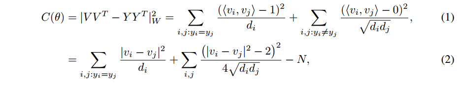
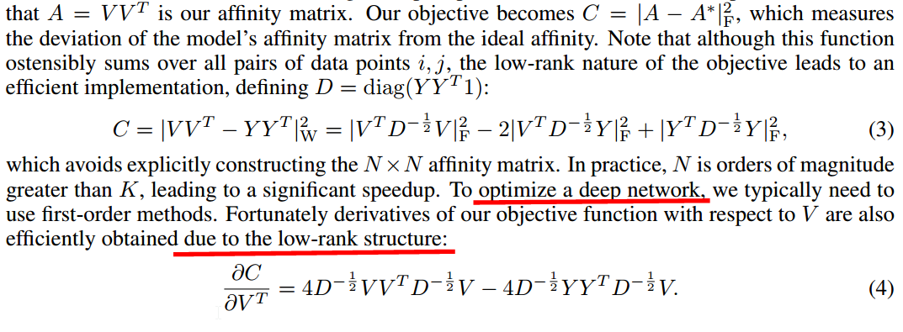

--- 
title: 17.2.28-3.1 Deep clustering Discriminative embeddings for segmentation and separation
date:   2017-03-1
---

* content
{:toc}

##  总览
我看作者主页（哥大的Zhuo Chen），人家貌似一直在做这个，貌似还搞过公司。

看一下行文，貌似是很随意的一篇文章，应用很有趣，框架像是随手拈来的……

应用背景太多，这个东西是两方面的
1. 聚类这么简单的思想也能干如此复杂的事
2. 背景太多，不方便读者去消化

我决定粗略看一下应用吧，当然主体是第3、4页。

## 核心
$V = f_θ(x)$, 参数是 $\theta$, 由DNN实现，还是老规矩，求出loss对 $V$ 的微分就行了 （注意 $V$ 是最后一层）。

## 细节

作者的符号notation不太好懂，我反正被绕晕了，$d_i$ 一会儿是vector一会儿又是一个数值，恩。
这个形式咋来的？有没有明显的借鉴，我见识太少，不得而知。

然而其物理意义却很显然：
这个目标函数将两个同一个partition中的点的内积 $<v_i , v_j>$ 强制接近1, 否则强制为0  
从(2) 看出来，将 类内variance |v_i − v_j|^2 最小化，并且 __while preventing the embeddings from trivially collapsing into the same point__.

然后，作者将这个formulation和spectral clustering关联了起来，

翻译一下，将模型的affinity matrix和理想的affinity matrix的deviation由目标函数1、2表达了出来，看起来这个式子将所有点对都加了起来，但它的low-rank nature是很有效的。

我没有搞懂人家咋变换的……

然后3式的微分就是4式，这样就可以用来优化DNN了

谱聚类一般是做一个low-rank approximation of a full-rank model，本文的方法是直接优化a low-rank affinity matrix 。

## 结论
这个东西一时半会儿看不懂，没关系，等积累够了再回来看。

本文算法还是很清晰的，DNN那一部分也许是太general了，着墨不多，主体都放在了loss的design上面，而且这个loss的变化很吸引人，就是搞出一个low-rank的出来，还不是逼近的，好神奇。