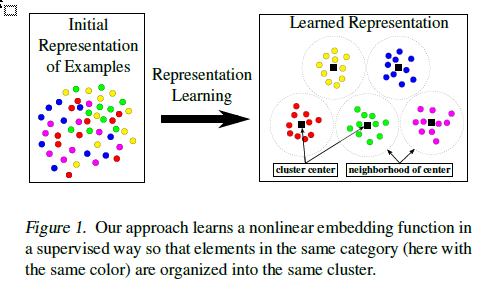

--- 
title: Deep Spectral Clustering Learning
date:   2017-11-1
---

* content
{:toc}

## 摘要
clustering的quality取决于两个problem-dependent factors
1. the chosen similarity metric and
1. the data representation.

本文贡献：
propose a deep supervised clustering metric learning method that formulates a novel loss function. 

作者derive a closed-form expression for the gradient that is efficient to compute

## intro
主要是学习representation，如下图

learn之后能控制close的程度，也就是distance metric。
the representations of training examples are closer to the representative vector of their category than to the representative vector of any other category.

本文是supervised clustering？

## 方法
用Bregman divergences将the problem of partitioning a dataset 给relax一下
这个变化后的问题（公式2）是NP-hard的，因此需要approximate一下，即relax，作者present a spectral relaxation of this problem。

以后再细看。