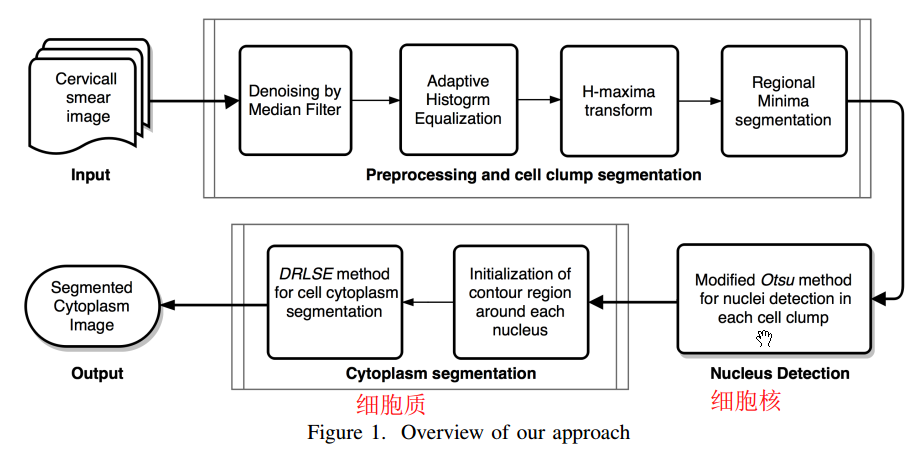
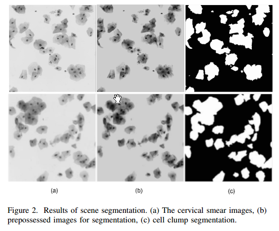
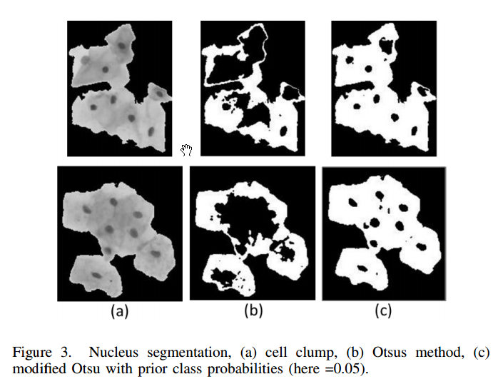
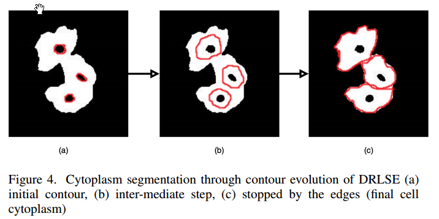

--- 
title: An Unsupervised Approach for Overlapping Cervical Cell Cytoplasm Segmentation
date:   2017-02-21
---

* content
{:toc}

## 简介
阿三哥写的文章，哈哈。

这篇文章非常偏应用，问题很具体（虽然我还没搞懂它说类啥），方法也很固定。
里边有很多专业名称，我就不去深究了；哦我查了一下，知道在干啥了，先看流程图吧：

非常中规中矩的cv应用
目的是分割细胞质，不同细胞的细胞质有可能重叠，三哥说就是三步走了：
1. 预处理，并把cell的区域分隔开
方法就是先median filter去噪声，然后直方图均衡化以improve对比度，最后采用H-maxima transform：即先suppress intensity image 中的极大值，然后中二值化，如图：

1. 细胞核分割
先上图：

中间是Otsus method，最右边是作者搞出来的改进版。Otsus法的输入就是gray-level histogram, Otsus法的定位是：**基于聚类的图像阈值化**，即得到一个最小化类内variance的阈值。 看来跟聚类是有关系的
三个搞出来的改进版，我没心思看啊。
1. 细胞质分割
上图：

这个用的是现成的方法，就是找到细胞核之后，使用level set evolution就行了，不细究了。

好了，流程就是这样了。
那么第一步河第二步有啥联系啊，我还没搞清楚第二步用的直方图是啥，阿三哥说话不太清晰嘛。

在http://cs.adelaide.edu.au/~zhi/isbi15_challenge/results.html 页面，只有俩队提交了结果，哈哈，我看到它们的paper都很简单吧，都是很基础的cv处理以及简单的intuition（虽然我没看懂哈哈）。
## 开一下脑洞
* 脑洞1
既然最后目标是分割细胞质，还有可能重叠，那么NPCM不就正好合适么？不过仔细想一下，还是很难的，关键是点咋来？这些像素都用上？肯定得阈值化一下嘛。
恩，可以玩儿一下，反正论文里也提到了数据来源（在实验部分）。
我找到了网站：http://cs.adelaide.edu.au/~zhi/isbi15_challenge/dataset.html

* 脑洞2
这次不是玩儿整个流程，而是关注于第二步，即**基于clustering的阈值化**

## 总结
这种中规中矩的文章，我只能看到一些新名词吧，可能偶尔会和聚类相关，以后少看吧？