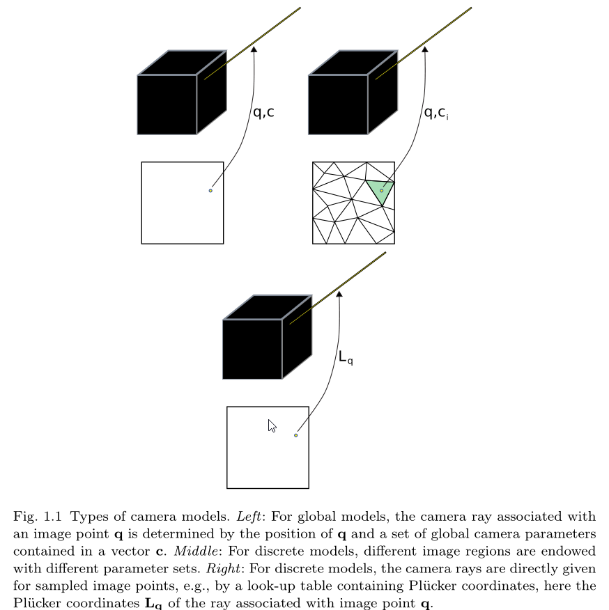

--- 
title: Camera Models and Fundamental Concepts Used in Geometric Computer Vision
date:   2020-02-19
---

* content
{:toc}

以下来自：
Sturm, P., 2010. Camera Models and Fundamental Concepts Used in Geometric Computer Vision. FNT in Computer Graphics and Vision 6, 1–183. https://doi.org/10.1561/0600000023

## 粗略读后感
这篇论文适合了解了所有模型后，猎奇用。
不适合学习相机模型用。

## 摘要
鉴于  geometric computer vision (“structure-from-motion”) 的 **算法和理论研究** 经常在没有突出 common underlying principles 的情况下被 `re-developed`，本文要综述：
1. 图像获取方法
2. camera model， 并指出不同模型之间的相似性。
3. 还有不同相机模型的 **极线几何和多视几何(epipolar and multi-view geometry)**。
4. 标定和自标定算法。

最后描述 geometric computer vision or structure-from-motion 的  fundamental building blocks：
1.  极线几何
2.  位姿和运动估计
3.  3D scene modeling
4.  bundle adjustment.

## Introduction and Background Material
### Introduction
相机模型，或者说是 ` a computational model for a camera`， 告诉我们两个信息：
1. 如何将 3D 点投影到 image 
2. 还有back-project，即从 image 到  3D

本文意识到，目前相机模型的分类是不太准确的，因为即使`非参模型` 其实也是`有参`的，例如camera rays的坐标。
因此本文分为三类模型：
1.  A global camera model
任何参数的改变都会影响所有视角（ field of view ）的投影函数， 例如经典的 pinhole 模型，以及 大多数鱼眼模型
2.  A local camera model 
每一个参数只和视角的某一个子集（a subset of the field of view）的投影函数有关，例如，定义在image或者 field of view 上的多边形区域上的“piecewise-pinhole”模型。
3.  A discrete camera model
每一个不同的像素点都有对应的参数。当然，一般只定义一部分像素点的参数，然后通过插值得到其他像素点的参数。

图中，第三个图像就是离散模型，其 camera ray 就是通过 Plücker 坐标的查找表得到的.
上面讲到了相机模型由两部分组成, 本文使用 back-projection来表示相机模型,也就是从像素点到相机光束(camera ray)的映射.

### Background Material
#### Plücker coordinates
首先是 3D 空间中 line 的表示：Plücker coordinates， 也就是说，一个line 可以由一个六维的矢量来表示。
本文讲的比较粗略，详细资料可参考： [Notes on Pluc¨ ker Coordinates](http://orb.olin.edu/plucker.pdf)。
这个坐标的好处是什么呢？
1. 这条直线的 direction 矢量 恰好是Plücker coordinates的前三个元素组成的矢量。
2. 这条直线与坐标系原点构成的平面的法向量（也就是the moment of the line） 恰好是Plücker坐标的后三个元素组成的矢量。

经过这个line的 direction 矢量 和 moment 矢量能够给 这个line上的点施加两个限制，并最终简化成一个线性方程。
#### Lifted coordinates
然后是Lifted coordinates。
本文讲的比较粗略，我参考了： [Epipolar Geometry of Central Projection Systems Using Veronese Maps](https://home.deec.uc.pt/~jpbar/Publication_Source/cvpr2006.pdf)
也就是：
>Barreto, J.P., Daniilidis, K., 2006. Epipolar Geometry of Central Projection Systems Using Veronese Maps, in: 2006 IEEE Computer Society Conference on Computer Vision and Pattern Recognition - Volume 1 (CVPR’06). Presented at the 2006 IEEE Computer Society Conference on Computer Vision and Pattern Recognition - Volume 1 (CVPR’06), IEEE, New York, NY, USA, pp. 1258–1265. https://doi.org/10.1109/CVPR.2006.111

在代数中，一个标准技巧就是通过寻找一个 embedding 将问题弄到高维空间，从而使非线性问题转化为线性问题。
上面的参考文献又指出另一个文献：
> J. G. Sample and G. T. Kneebone. Algebraic Projective Geometry. Claredon Press, 1998.

## Technologies
这一节讲了各种类型的相机的构成。

## Camera Models
首先介绍一下Back-projection 和 forward projection的区别。
二者互相定义，但很多情况下，只有其中一种形式比较好表示。
一般来说，back-projection 更加容易进行 formulate。例如，当我们使用点坐标的有理多项式函数来表示相机模型的时候，使用back-projection就会非常直接，然而使用 forward projection就会发现，映射到同一个像素点的 3D 点组成的是一个曲线，也就是 curved
“camera rays”。

Back-projection 一般有两种 formulation：
1. 根据像素点计算出 camera ray的两个点： point at infinity $B^i$， 以及  a finite point $B^f$。
此时，
2. 根据像素点计算出 camera ray的Plücker coordinates $B^l$

### 全局模型
首先是 Pinhole model， 其image points 和  ray directions的关系为：
$$q\sim KB^i$$ 
其中 $\sim$ 表示两边差一个scale， $K$ 为内参矩阵。

对于经典的  polynomial distortion models 来说，distortion corrected image points 就对应于普通 pinhole model 的像素点，和 camera ray的关系为：
$$ B^i \sim K^{-1}\left(\begin{array}{c}x_u\\ y_u \\1 \end{array}\right)$$

至于其他模型则形式更复杂一些。例如Polynomial and Rational Polynomial Models。
### 局部模型
包含Two-Plane Model等模型。
### 离散模型
略。

## Epipolar and Multi-view Geometry
略
