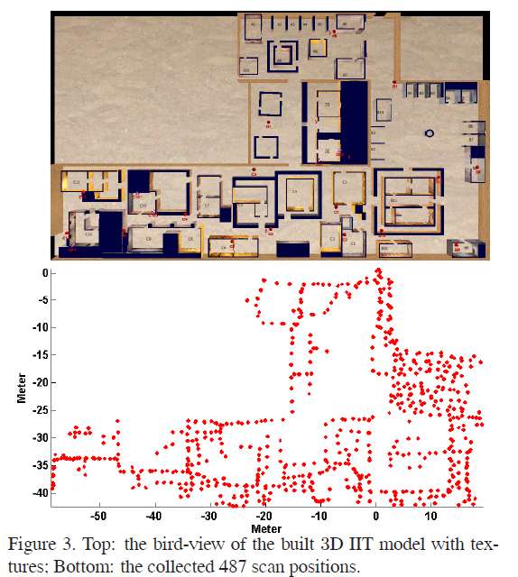
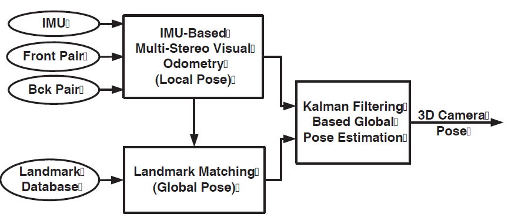

--- 
title: High-precision localization using visual landmarks fused with range data
date:   2018-12-18
---

* content
{:toc}

以下来自：
[1]ZHU Z, CHIU H-P, OSKIPER T等. High-precision localization using visual landmarks fused with range data[C]//Computer Vision and Pattern Recognition (CVPR), 2011 IEEE Conference on. IEEE, 2011: 81–88.

## Simultaneous 3D Model and Visual Landmark Database Construction
1. 用 LIDAR 扫描，通过 ICP 处理重叠的点，这样就生成了点云。
2. 生成 visual landmark: 对于每一次的扫描，得到accurate camera pose，2D features（图像特征），以及 3D location

本文建立了包含 487 次扫描的 visual landmark database，大约 1.8GB。

## 下面将介绍 Localization With Landmark Matching

### 总体介绍
三个模块：
1. IMU fused multi-stereo visual odometry,
2. landmark matching
3. Kalman filtering based global localization estimation

首先加载 visual landmark database。
然后系统获取传感器数据，即
1. synchronized stereo image pairs
2. IMU measurements。

这俩数据送到 `visual odometry module` 中。
1. 从图像中提取 Harris corners ，并从 Harris corners 中估计相机的初始姿态（`initial camera pose`）。
2. 上一步得到的 `initial camera pose` 再和 IMU measurements 进行融合，得到相机姿态（当然是局部坐标系的位姿啦）的更为精确的估计。

IMU measurements 的融合主要是考虑到场景中没有texture或者相机被遮挡的情况。

因此，从`visual odometry module` 可以得到相机在局部坐标系中的位姿。
好了，实际上我们已经有了如下信息：
1. stero 相机的左相机的图像
2. 提取出来的Harris corners
3. 相机的位姿

这三个东西要送到 `landmark matching module`。在这个module中，我们要为每一个 Harris corners 提取 HOG descriptor。
这样我们就得到了由四个部分组成的`query landmark shot`:
1. the normalized 2D image coordinates
2. 3D coordinates
3. the HOG descriptors of the corner
4. the camera pose

这个 `query landmark shot` 用于在 `the landmark database` 中搜索 potential similar landmark shots, 然后使用 image-based 2D matching来精简 potential landmark shot list。
找到matched landmark shot之后，就可以计算相机在全局坐标系中的坐标了。

由于matching直接用于确定全局坐标系中的坐标，因此必须对matching的质量严格把关，作者采用了a visual odometry trajectory based consistency check。

matching之后，__由于 landmark matching 可能存在误差__，因此需要将这一步估计出来的全局坐标系下的位姿送到一个 `global localization module` 中，来进一步估计全局坐标。

### Efficient Landmark Matching with Disk-Cache Mechanism 
略过

### Local Visual Odometry Trajectory Based Consistency Check
为了提高定位的 robustness，从 matched landmarks 计算出来的 pose 要先和 visual odometry 计算的pose进行对比，以去除any possible wrong matches，并对landmark matching 施加 temporal consistency。

怎么对比呢，绝对位姿没法比，相对位姿还是可以的。
假设一个对象从 A 点到达 B点，我们可以
1. 从visual odometry模块得到一个 A B之间的相对位姿，
2. 也可以从matching模块中，提高A，B 图像与landmark database中matching之后计算的位姿得到一个相对位姿。

在短时间内，我们认为 visual odometry得到的相对位姿更准确，因此如果这俩相对位姿比较一致，那么就认为matching就很good。

### Kalman Filter Based Fusion for Global Localization
我们要估计每一帧在全局坐标系中的位置
这一步其实就是将IMU-based multi-stereo visual odometry module 估计得到的 `local pose`，
__转换__ 到
从第一个成功的landmark matching估计得到的 `global camera pose` 所在的全局坐标系。

本文的基于 Kalman Filter 的 global pose estimation module 的输入为：
1. the query landmark shot (2D)
2. matched database landmark shot (3D)
3. the estimated global camera pose of the query shot

然后，从 IMU-based multi-stereo visual odometry module __转换__ 得到的 `global pose` 再和Kalman filter得到的 `global landmark point measurements` 进行融合。
>此处的 `global landmark point measurements` 怎么得到的呢？就是2D to 3D的特征点的匹配啦，即the query landmark shot中的特征点 和 matched database landmark shot 中的 3D local point cloud 进行匹配。

我们要使用 `estimated global pose of the query shot`，将 __每一个__ 3D `local landmark point` ${\bf X}$, 转化到 全局坐标系。
将姿态表示为：$${\bf P}_{LG}=[{\bf R}_{LG},{\bf T}_{LG}]$$，那么 $${\bf X}$$ 就可以按照如下方程进行转换：
$${\bf Y}={\bf R}_{LG}{\bf X}+{\bf T}_{LG}$$

在 small error assumption 的时候，上式可以表示为：
$$\hat{\bf Y}+\delta {\bf Y}\simeq ({\bf I}-[{\mbi \rho}]_{\times})
\hat{\bf R}_{LG}(\hat{\bf X}+\delta {\bf X})+
\hat{\bf T}_{LG}+\delta {\bf T}_{LG} $$

我不知道为啥这里是减号而不是加号。
这里的 $\rho$ 是一个小的旋转矢量。
上式展开，忽略掉二阶项之后就得到如下的 __线性化__ ：
$$\delta {\bf Y}\simeq \hat{\bf R}_{LG}\delta {\bf X}+\left[\hat{\bf
R}_{LG} \hat{\bf X}\right]_{\times}{\mbi \rho}+\delta {\bf T}_{LG}
\eqno{\hbox{(3)}} $$

令 $$\tilde{\bf X}=\hat{\bf R}_{LG}\hat{\bf X}$$。
那么 `local 3D (landmark) point` 的 协方差矩阵 ${\bf \Sigma}_{Y}$ 可以在全局坐标系中使用如下的项进行表示：
1.  local reconstruction uncertainty, ${\bf \Sigma}_{X}$,
2.  the weight factor of the query landmark shot, ${\mbi W}$, 并将其建模为 `query landmark shot` 和 `matched landmark shot` 之间的距离，它反映了landmark matching的精度。
3.  landmark pose uncertainty in rotation and translation, ${\bf \Sigma}R_{LG}$ and ${\bf \Sigma}T_{LG}$

即：
$${\bf \Sigma}_{Y}\simeq\hat{\bf R}_{LG}(W{\bf \Sigma}_{X})\hat{\bf R}_{LG}^{T}+ [\hat{\bf X}]_{\times} {\bf \Sigma}R_{LG} [\hat{\bf X}]_{\times}^{T}+ {\bf \Sigma}T_{LG}$$

将上述步骤应用到 successful landmark matching 的 `所有的 point correspondences`

然后使用下面文献的方法将`所有的 point correspondences`融合到Kalman filter中：
>A. Mourikis and S. Roumeliotis. A multi-state constrained kalman filter for vision-aided inertial navigation. In IEEE Conference on ICRA’07, 2007. 81, 85