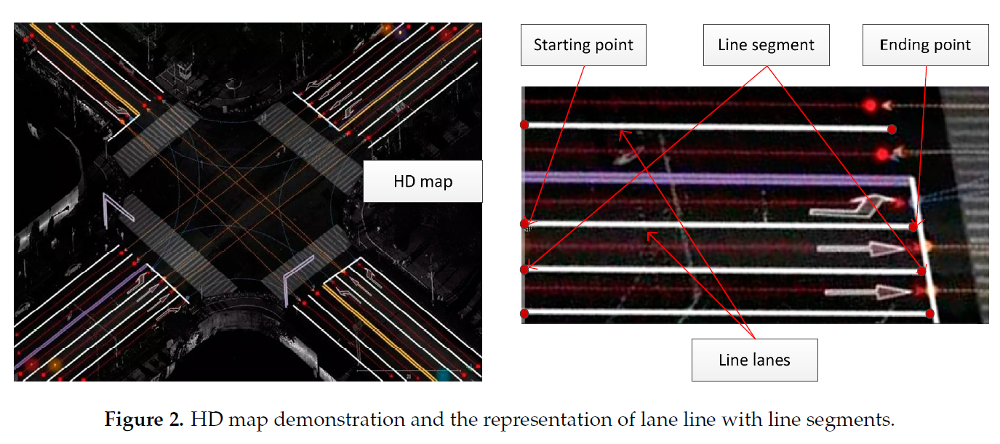
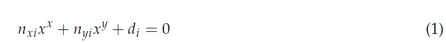
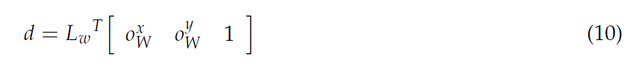
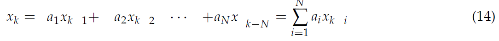
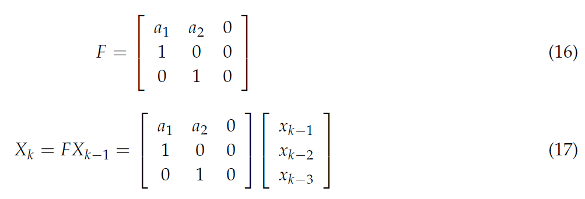
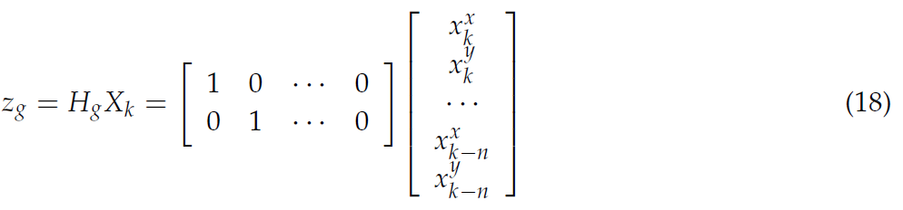
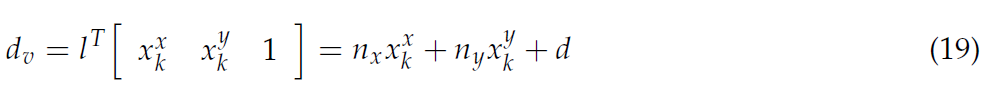
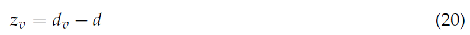
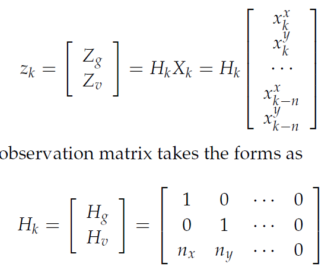

--- 
title: Integration of GPS, Monocular Vision, and High Definition (HD) Map for Accurate Vehicle Localization
date:   2018-12-25
---

* content
{:toc}

以下来自：
[1]CAI H, HU Z, HUANG G等. Integration of GPS, Monocular Vision, and High Definition (HD) Map for Accurate Vehicle Localization[J]. Sensors, 2018, 18(10): 3270.

## 摘要
本文：
1. 在卡尔曼滤波的prediction step，使用黑箱模型而非常用的运动学模型（Kinematic model）
2. 卡尔曼滤波的观测数据分为两部分，一个是raw GPS coordinate，另一个是（从单目相机计算出来的）车辆和车道线之间的距离。

## 本文方法
### 地图

将地图的坐标转换成 UTM 坐标，并使用方程表示每一个 line segment:

其中，$(n_x,n_y)$ 为单位法向量， d 为到原点的距离。

### 测量数据
车道检测采用如下文献的方法：
>31. Li, J.; Mei, X.; Prokhorov, D. Deep neural network for structural prediction and lane detection in traffic scene.
IEEE Trans. Neural Netw. Learn. Syst. 2017, 28, 690–703. [CrossRef] [PubMed]

相机的标定采用：
>32. Zhang, Z. A flexible new technique for camera calibration. IEEE Trans. Pattern Anal. Mach. Intell. 2000,
22, 1330–1334. [CrossRef]

然后利用路面的法向量，计算路面和图像之间的单应变换，据此可以算出车辆与车道线之间的距离。

这里的d应该就是后面提到的 $d_v$。
### Data-Driven Motion Model for State Transition
状态转移矩阵的求取比较简单。
首先根据

得到这些系数以后，就得到状态转移矩阵了：

### 观测数据
测量数据分为两部分。

第一部分是gps测量：

这个测量值确定了测量矩阵的一小部分。

第二部分就是利用上面的节提到的车辆到旁边的车道线的距离了。（当然也可以同时计算车的左右车道线的距离，下面以检测到一个车道线为例）。
根据当前GPS坐标，确定临近的车道线，然后将gps坐标代入该车道线的方程，即可得到点到直线的距离：

也就得到了第二部分的测量：

最终总的测量如下：

如果是检测到两个车道线，那么观测方程就有四行了。