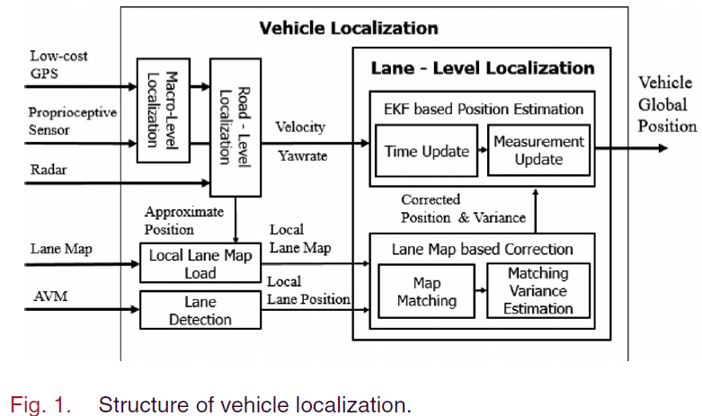
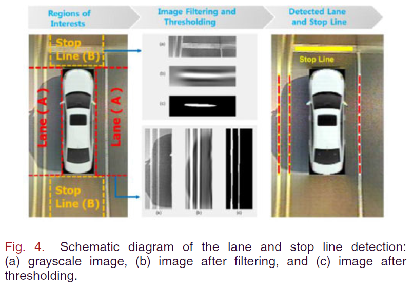
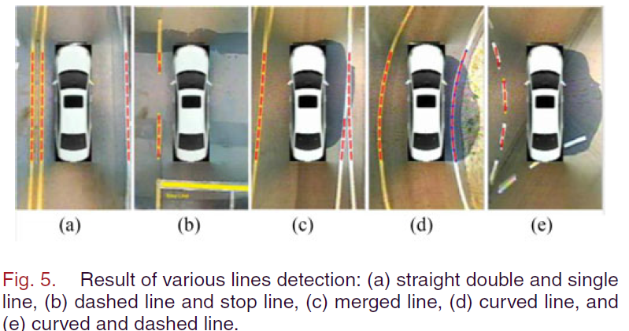
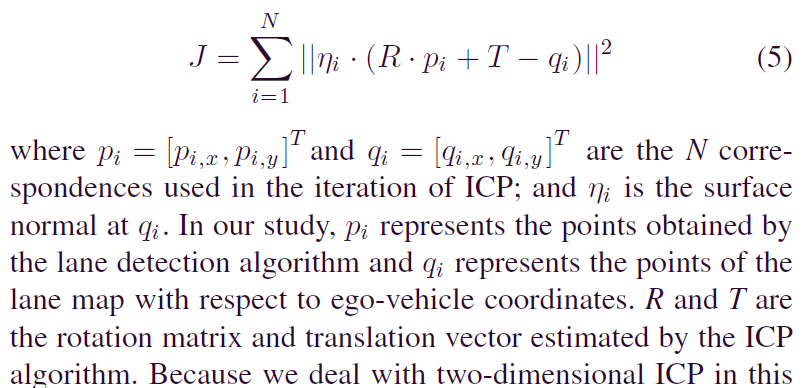
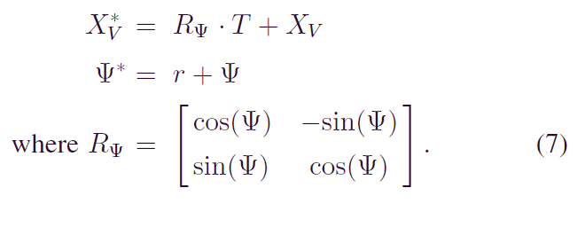
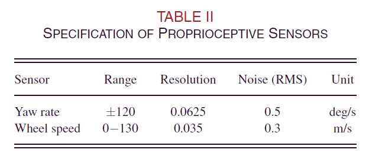
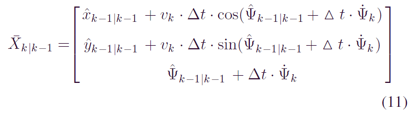

--- 
title: Lane-Level Localization Using an AVM Camera for an Automated Driving Vehicle in Urban Environments
date:   2018-12-24
---

* content
{:toc}

以下来自：
[1]KIM D, KIM B, CHUNG T等. Lane-Level Localization Using an AVM Camera for an Automated Driving Vehicle in Urban Environments[J]. IEEE/ASME Transactions on Mechatronics, 2017, 22(1): 280–290.

## 摘要
本文
1. 利用车辆的环视系统（AVM around view monitoring）的图像和地图进行 ICP 匹配。
2. 然后计算地图和图像之间的变换。利用这个变换对vehicle position进行校正，然后和vehicle sensors得到的信息使用 EKF 进行融合。
3. ICP 的协方差使用 Haralick’s method 进行估计。
4. 达到了分米级的精度。

## 定位系统 总览

1. Macro-level localization。 使用 ，low-cost GPS and proprioceptive sensors，精度为 10m 的量级。
2. road-level localization。用来确定在哪个车道。常用作 lane-level localization 的初始值。
3. lane-level localization。分米级。

使用 环视系统（AVM）的理由：
1. 顶视图可以直接计算与车道线的横向距离。
2. 当车的front camera的前视图被遮挡，即周围车辆很多的时候，顶视图还有效。

## 环视相机的车道线检测

为了计算方便，并考虑到远处的图像有distortion，因此，只处理车辆周围一小块区域的像素，称其为 regions of interest (ROI)。
如上图 a所示。
并且我们只考虑 lane or stop line, vertical or horizontal line 这几种类型。

然后使用 二维 Gaussian kernel，根据期望的线的高度或宽度来设置滤波器的参数，然后将滤波后的图像根据某个阈值进行二值化。

将低于该阈值的像素丢弃掉，高于该阈值的像素投影到车辆坐标系，使用 RANSAC 拟合二阶多项式来表示这些线。
RANSAC algorithm 的两个参数：
1. iterations number ：设为 50
2. threshold distance to determine outliers：设为 0.05m

检测结果如下图：

## 通过与地图匹配来获得观测数据，即POSITION CORRECTION
### Map-Matching Based on ICP （测量值）
使用 二维 point-to-plane ICP 算法进行匹配。
迭代：
1. 计算两个点云的对应关系
2. 计算对应点的最小化最小化某个度量函数的变换

令 $(X_V,\Psi)$ 表示车辆的当前位姿，矫正后的位姿(也就是 __观测值啦__)为：

### 协方差 （测量噪声）
然后使用 Haralick’s method 来估算 ICP 的协方差。

## LOCALIZATION FILTER

### EKF
传感器的 process noise:

状态方程很简单：

### Validation Gate
对于 false matching，我们当然不能去融合啦。
validation gate就是一个阈值，超过这个阈值，那么这个测量就没法用。
本文采用的是 3sigma 法则（three-sigma gate）。

