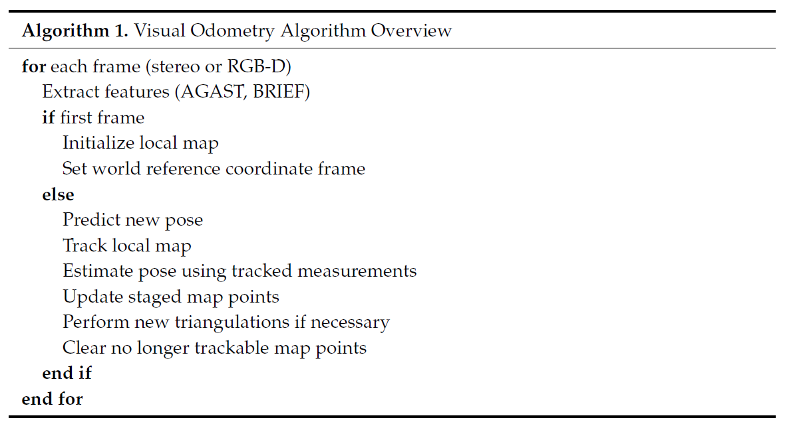

--- 
title: Lightweight Visual Odometry for Autonomous Mobile Robots
date:   2018-12-17
---

* content
{:toc}

以下来自：
[1]ALADEM M, RAWASHDEH S. Lightweight Visual Odometry for Autonomous Mobile Robots[J]. Sensors, 2018, 18(9): 2837.

## 摘要
本文的估计系统（ego-motion estimation `visual odometry`）：
1. low-overhead 
2. real-time 
3. 适用于 stereo 或 RGB-D 相机
4. 维持了一个local map，比基于（full visual SLAM常用的）global map 的计算量小、内存小
6. 比基于frame-to-frame的法的精度高

本文对应的 [基于ROS的代码](https://github.com/SAR-Research-Lab/lvt)。

## intro
主动式的传感器如声呐和超声波容易interfere with each other。

Cameras不会互相干扰。

## Related Work
本文搞的是visual odometry。

很多visual odometry算法是通过 match  或 track 相邻帧的特征，并使用这些特征来做姿态估计的。

还有一种是，将以前的每一个特征的测量位置进行平均（sample mean），得到integrated features，然后利用integrated features计算相邻帧的运动。

本文则利用一个临时的local 3D map，我们可以评估每个特征是否有用，从而决定是否将其放到这个local 3D map中。

visual odometry 和 SLAM 的不同在于 SLAM 利用回环检测等来矫正地图，从而提高精度。
在 slam中，一开始主流是基于 filter的，如（EKF ）。
从PTAM 开始利用关键帧和bundle adjustment，文献
`Younes, G.; Asmar, D.; Shammas, E.; Zelek, J. Keyframe-based monocular SLAM: Design, survey, and future directions. Robot. Auton. Syst. 2017, 98, 67–88.`
介绍并综述了基于关键帧的visual SLAM。

不管是Visual SLAM 还是 odometry systems都可分为直接法和特征法。
直接法就是只根据整张图像，通过优化的方法进行定位，如 LSD-SLAM。
特征法就要在帧与帧之间跟踪特征点，如S-PTAM 和 ORB-SLAM。

## 算法

### Image Sequence
对于 stereo camera，需要将其frame给 stereo-rectified。
对于RGB-D相机，先将RGB图像转化为灰度图，然后和depth image一起送到系统中。

### Feature Extraction
提取的是salient point or corner-like features。

使用 `AGAST corner detector`以及`BRIEF descriptors`。

如果特征集中在图像的一小部分区域，那么这个图像就是Poor distribution。
可以这么办：
1. 将图像分割成小的cell，在每一个cell中分别进行特征检测
2. 对每一个cell，采用adaptive non-maximal suppression进行处理。这样就能限制特征的总数目的同时，保证特征分布在整张图像上。

### Pose Prediction
运动模型很简单。
使用轮速编码器的dead reckoning就行了。

### Tracking Local Map
这一步的目标是，将 3D地图点和 2D 的图像特征进行匹配。

对于 stero相机，可以先将 3D map points 投射到（project）the left camera 的图像平面上。
对于 RGB-D 相机，通过针孔模型进行投射。

对于每一个投射后的地图点，在25个像素的半径内，搜索最近的图像的特征点，若找不到足够的特征，就将搜索半径加倍。

邻域搜索使用 `spatial hashing` 的技巧进行加速。

### Pose Estimation
匹配的特征点用于优化。
将 R，t矩阵进行优化，最小化地图点和特征点之间的reprojection error。

### Local Map Maintenance
除了用于Pose Estimation的地图之外，还维持了一个备胎特征点的地图，这些点仅用于track，不用于Pose Estimation。

每次计算完Pose Estimation，就会更新备胎地图。

每一次 3D-points triangulation 发生的时候，就将这些点存到备胎地图中，如果，备胎地图中的某个特征点在好多帧中都能track到，那么就把它转正，加到主地图，即local map中，否则就从备胎库中删掉啦。

但如果主地图中点不够用，即小于1000个，那么备胎库中的点会被立即转正。
或者初始化的时候，即第一帧的备胎点都会立刻转正。

问题来了，啥时候会发生points triangulation呢？
如果当前帧以及前两帧的匹配点的数目在下降，这时候就要perform new triangulation啦。
新的点从哪里来呢，就是triangulated from features that were not tracked in the current frame，然后这些点就加到备胎库啦。

对于stero相机，采用Linear-LS method进行triangulation，
对于RGB-D相机，直接从深度图中提取深度值就行了。

