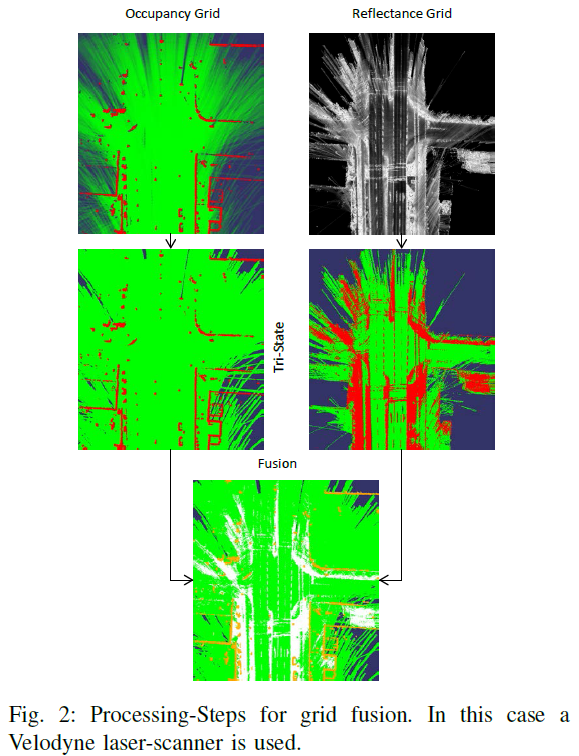
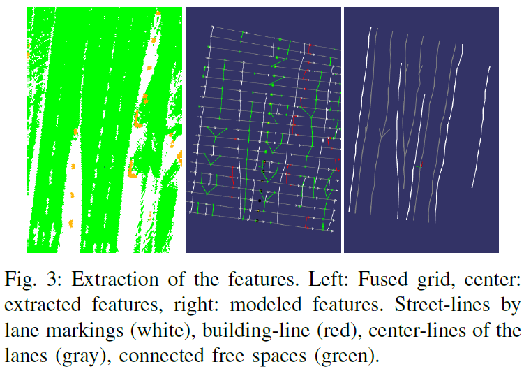
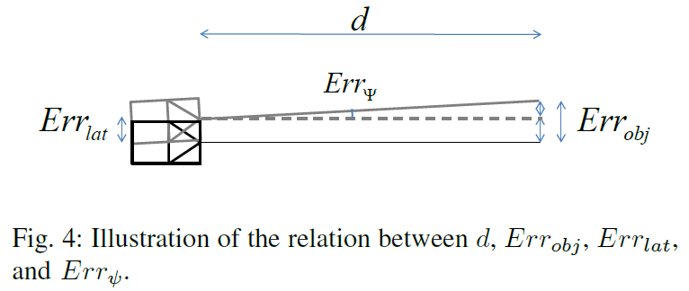
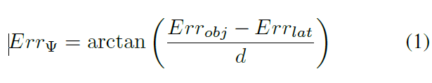
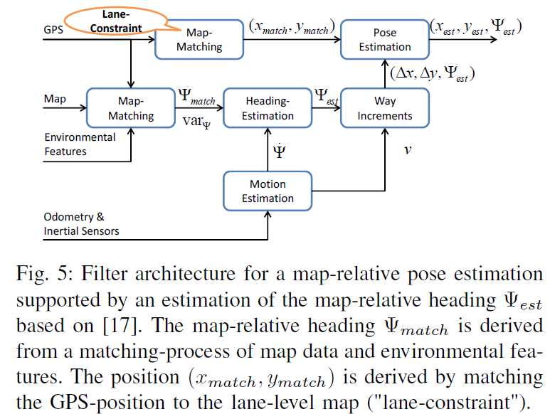
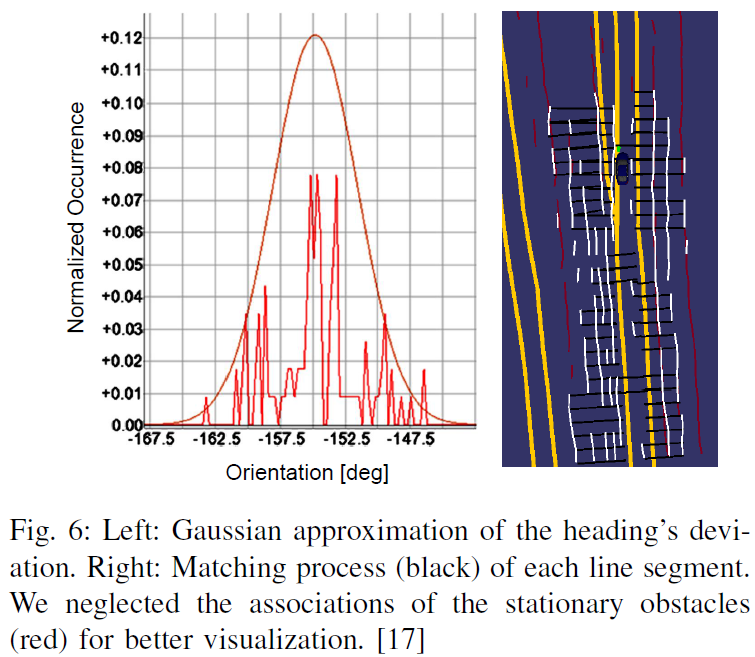
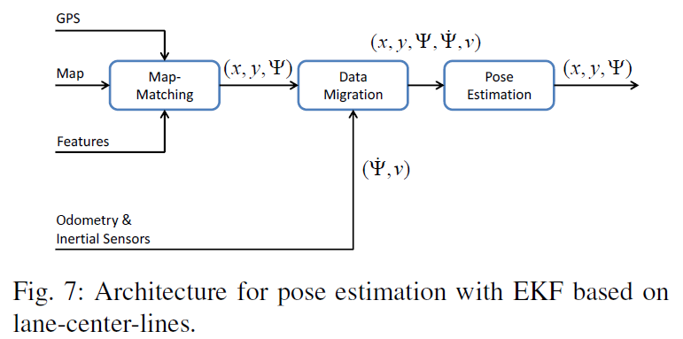

--- 
title: Map-relative localization in lane-level maps for ADAS and autonomous driving
date:   2018-12-24
---

* content
{:toc}

以下来自：
[1]MATTHAEI R, BAGSCHIK G, MAURER M. Map-relative localization in lane-level maps for ADAS and autonomous driving[C]//in Intelligent Vehicles Symposium (IV), 2014 IEEE. 2014.

## 摘要
本文
1. 提出并比较了两种 基于 lane-level map 的定位方法。其实就是使用 卡尔曼滤波先估计车辆的朝向，然后估计车辆的位姿。
2. 这两种方法故意不去用 地图中的point-landmarks, grids or road-markings.
3. 对于城区的missing or incomplete road-markings的情形，作者使用基于格点的方法融合 road-marking information 和 stationary obstacles。

## 这个应该是建图环节 GRID FUSION AND FEATURE EXTRACTION
总览：
1. 使用 the street- and building-lines 来确定车辆的朝向信息。
1. 使用车道线的中心线（lane-center-lines）来对车辆到车道线的lateral position进行辅助判断

首先是格点融合

然后是特征提取

## LANE-LEVEL MAPS 中的定位

### 朝向的定位需求
要想做到 60 m（用d表示）远的检测到的object的定位误差（用 $Err_{obj}$ 表示）小于半个车道的宽度（大约1.5米）

上图中，在给定的lateral position error $Err_{lat}$ 下，允许的朝向误差为：

当60米远误差为1.5米时，若 $Err_{lat}=0.75$ 米，这个最大角度是 0.7

### Lane-Matching with Heading Correction
本文的总框图为

本节探讨 $\Psi_{est}$ 的估计，即 __使用卡尔曼滤波来估计 map-relative heading 的 $\Psi_{est}$__。

首先将地图中的direction of the lanes，和感知到的 lines and building lines 进行匹配，
这样就能得到车辆在地图中的朝向 $\Psi_{est}$。
这样就得到了朝向 $\Psi_{est}$ 的 __观测数据__。

而车辆运动的 yaw rate $\dot \Psi$ 则用来作为 朝向 $\Psi_{est}$ 的卡尔曼滤波的 __状态方程的control input__。

观测方程中的 $\Psi_{est}$ 的协方差由matching 的statistical analysis得到。

然后将速度 $v$ 和 朝向 $\Psi_{est}$ 转化成笛卡尔坐标系中的位置的变化 $(\Delta x;\Delta y)$.

这里解释一下作者单独使用卡尔曼滤波来估计朝向的动机。
图 5 中 $(x_{match}; y_{match})$ 是通过匹配 GPS-position 和 the lane-level map ("lane-constraint")得到的。
这里只允许使用朝向来修正 $(x_{match}; y_{match})$，而不允许使用 $(x_{match}; y_{match})$ 来修正朝向，这是因为 $(x_{match}; y_{match})$ 是从 GPS 得到的，因此可能是不连续的。

### Pose Estimation with an Extended Kalman Filter

图中的 map-matching 的输入为：
1. GPS-pose
2. the lane-level map
3. lane-center-lines extracted e.g. from the grid, as mentioned in section III-D （雷达）, or directly from a camera image.

map-matching 的输出为：map-relative pose $(x,y,\Psi)$。

首先根据以下文献的 topological map-matching 方法得到车辆的 map-relative pose 的初始估计：
>[18] M. a. Quddus, W. Y. Ochieng, and R. B. Noland, “Current mapmatching algorithms for transport applications: State-of-the art and future research directions,” Transportation Research Part C: Emerging Technologies, vol. 15, no. 5, pp. 312–328, 2007.

观测数据怎么得到？
提取周围的车道线，并将其变换到车辆坐标系，然后使用 ICP 计算 lane-center-lines from the grid and the lane-center-lines from the map 之间的单应变换。
$(x,y,\Psi)$ 的方差也从 ICP 得到，即提取到的特征点的对应点的均方误差。

实际上，上面 ICP 得到的数据是可以直接用的，但当matching-process不成功，或者没法提取车道线的时候 ICP就没法用了， __为了保证every time step都有估计值，即保证 consistency，我们需要使用 Extended Kalman Filter__。

EKF 的状态空间为：
$$\vec{x}=(x,y,\Psi,\dot{\Psi},\ddot{\Psi},v)^T$$
>注意，这里加入了朝向的二阶微分。
朝向的二阶微分 $\ddot{\Psi}$ 的加入能够允许我们 在不需要预处理的情况下 smooth the turn-rate signal。

测量矢量从图7中的Data Migration block得到：
$$\vec{z}=(x,y,\Psi,\dot{\Psi},v)^T$$

另外：
1. 只要 图7 中的Map Matching一旦计算完成，我们就要根据角度和上一次match以来的时间来计算turn-rate。
2. $\dot{\Psi},v)$ 的方差从哪儿来呢：
>sensor-specifications and exemplary test-drives with referencing sensors