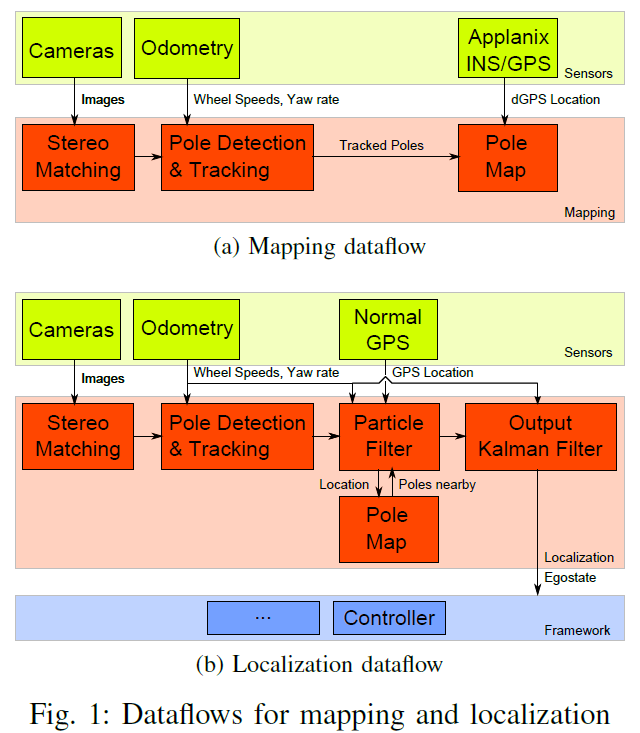
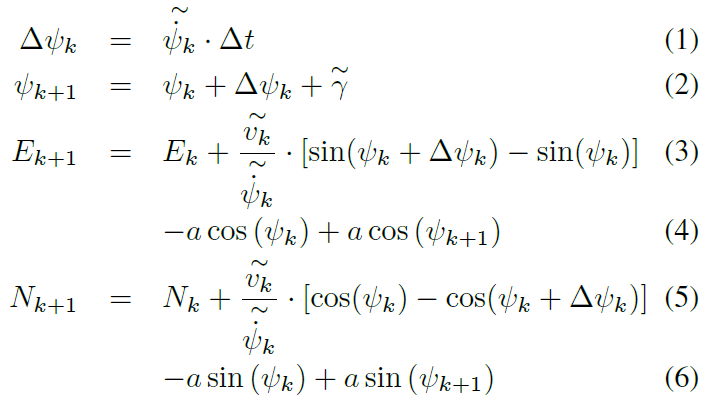
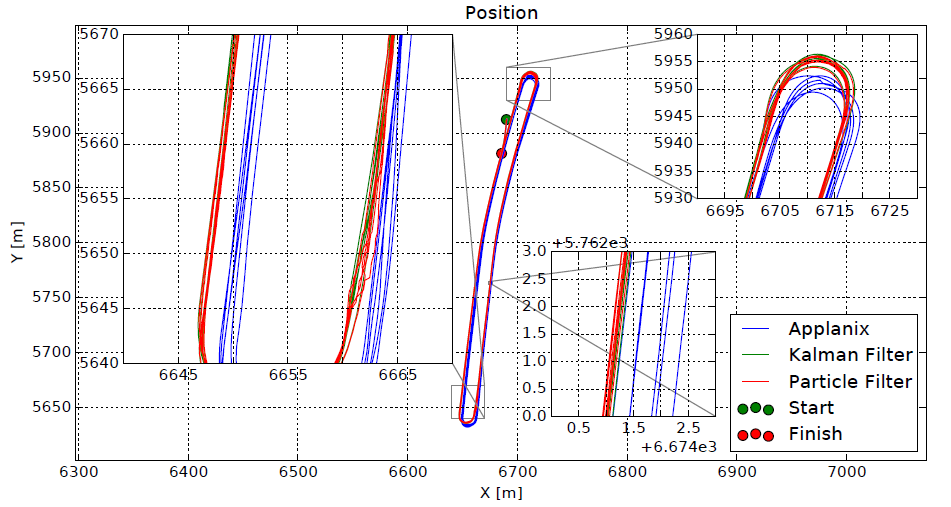

--- 
title: Pole-based localization for autonomous vehicles in urban scenarios
date:   2018-12-24
---

* content
{:toc}

以下来自：
[1]SPANGENBERG R, GOEHRING D, ROJAS R. Pole-based localization for autonomous vehicles in urban scenarios[C]//2016 IEEE/RSJ International Conference on Intelligent Robots and Systems (IROS). Daejeon, South Korea: IEEE, 2016: 2161–2166.

## 摘要
本文：
1. 将 pole-like landmarks 作为 primary features，因为这些 pole-like landmarks， distinct, long-term stable and can be detected reliably with a stereo camera system
2. 将 a stereo camera system 作为 main sensor
3. 将 vehicle odometry 和 GPS 作为 secondary information sources    
4. 定位 使用 particle filter 和 Kalman filter 的耦合
5. lateral accuracy below 20cm

## 总览
1. 建图阶段，根据rSGM 算法得到的disparity map进行Pole detection and tracking 。
2. GPS 为 particle filter 提供初始化，然后 particle filter 根据 landmark 进行更新。
3. 输出端使用 Kalman filter 来 __隐藏计算延迟__，并保证 100 Hz update rate。
4. 定位结果可直接用于behavior planning and low-level control。

## 定位
### 粒子滤波部分
车辆的姿态估计 $\text{p}$ 由Universal Transverse Mercator (UTM)坐标系中， k 时刻的诸多粒子 $\text{p}_{k}^{i}$ 表示：
$$\text{p}_{k}^{i}=[E_{i}N_{i}\psi_{i}]^{T}$$
预测方程：

似然计算以及重采样略过。
### 卡尔曼滤波部分
为了保证robustness，以及smooth state estimation with an update rate of 100 Hz。
卡尔曼滤波器的状态为：
$$\mathbf{x}=(x,\ y,\ \psi,\ v,\dot{\psi})^{\text{T}}$$
vehicle dynamics采用Constant Turn Rate and Velocity Model (CTRV)。

在各路传感器输入的频率都很低的情况下，如何保证最终的输出是高频率的呢？
>The Kalman filter includes all results as soon as they are available, time stamping makes sure that the filter is updated correctly, partially redoing calculations if measurements arrive too late.
__The output is generated independently from the sensor input by filter prediction.__

为了避免粒子滤波估计的车辆姿态出现sudden jumps，对其输出施加了一个validation gate，即抛弃掉明显不合理的输出，此时仅使用odometry measurements。

## 实验部分
作者着重算法的可重复性。
在同一路段，跑很多圈，并记录每次的定位结果。

可以看到，粒子滤波在某些地方会出现跳变，经过卡尔曼滤波之后更smooth，而传感器的原始数据Applanix的可重复性最差。