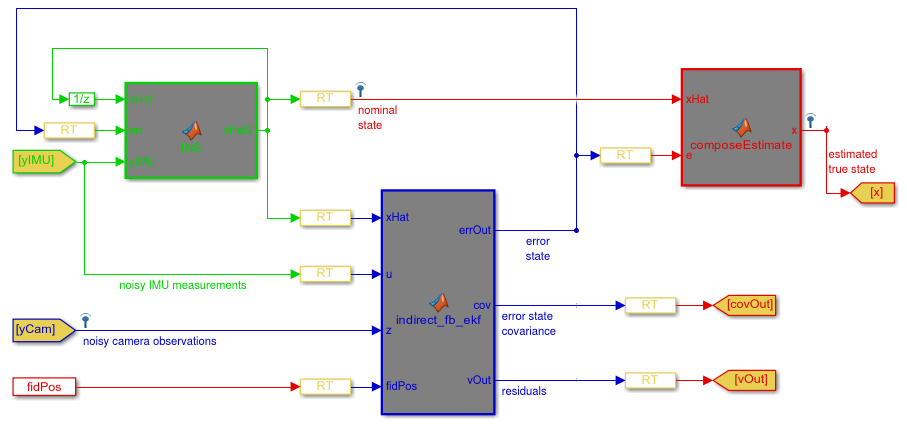

--- 
title: 基于 Kalman Filter 的 IMU Navigation 资源汇总
date:   2018-12-19
---

* content
{:toc}

## msckf
三个资源：
1. [tomas789/tonav](https://github.com/tomas789/tonav/tree/master)
有代码，作者说不稳定。
2. [TurtleZhong/msckf_mono](https://github.com/TurtleZhong/msckf_mono)
有[代码](https://github.com/TurtleZhong/msckf_mono/tree/master/src/msckf_mine_1.0)，作者说有很多bug。
这里的src文件夹有很多KF的资源，还有下面第三个代码的注释。
作者还有[一步步深入了解S-MSCKF](http://www.xinliang-zhong.com/msckf_notes/)（得有梯子才能看）。
还有`Quaternion kinematics for the error-state Kalman filter.pdf 作者推导注释过的书`
3. [KumarRobotics/msckf_vio](https://github.com/KumarRobotics/msckf_vio)
很好的代码

## ESKF 的结构是啥，怎么推导误差方程？
[What is the structure of an indirect (error-state) Kalman filter and how are the error equations derived?](https://stackoverflow.com/questions/27857683/what-is-the-structure-of-an-indirect-error-state-kalman-filter-and-how-are-the)
使用 IMU 和 __已知路标__ 的camera观测进行定位。
可以使用EKF，也可以使用indirect-feedback Kalman Filter (a.k.a. Error-State Kalman Filter, ESKF)。

作者用于实现ESKF的两个资料：
1. [Quaternion kinematics for the error-state KF](https://arxiv.org/abs/1711.02508)
这个资料很好地描述了ESKF的结构。另外[这里](https://github.com/TurtleZhong/msckf_mono/blob/master/Quaternion%20kinematics%20for%20the%20error-state%20Kalman%20filter.pdf)有一个带有中文注释的版本。
2. A Kalman Filter-based Algorithm for IMU-Camera Calibration
这个资料包含了vision measurement model的细节。

__作者提问了如何推导测量模型的 error-state equation。__

### 回答1：用于导航的、基于四元数的KF
>Kalman Filter is `an elegant mathematical technique` which borrows from the science of stochastics and measurement

KF 使得我们能够在不需要精确地对noise进行建模的情况下（elaborately modeling the noise），减少系统的噪声。

用 KF 的前提是，我们对要减少噪声的模型已经有了some preliminary understanding。
>The measurements are fed back to evolve the states better (the measurement equation Y = CX).

误差方程（error equation）其实就是对Kalman Gain有贡献的协方差。
>Low covariances denote less deviation from the mean behavior for any system. As KF cycles run the covariances keep getting smaller.

Kalman Gain 最终用于补偿 `我们对测量的估计` 以及 `从相机得到的真实测量` 之间的 `误差`。

对于四元数而言，`this elegant technique` 能够保证四元数的值收敛到0附近。

有非线性测量的构建 technique 的时候，EKF is a great technique。
但使用 EKF 的时候，系统中不能有太多的变换，即，不要试图在state上进行变换来reconstruct measurements，
这是因为：`noise covariances would not undergo similar transformations`
这样就有可能导致矩阵不可逆，，碰到singularity。

对于高手来说还可以看这个：
>You could look at constant gain KF schemes, which would save you from covariance propagation and save substantial computation effort and time. These techniques are quite new and look very promising. They actively absorb P(error covariance), Q(model noise covariance) and R(measurement noise covariance) and work well with EKF schemes.

### 回答2
作者的The KF state是vector of error terms，因此测量就是 `estimated true state` 与 `noisy camera observations` 中的位置之差。

至于 IMU 和 ESKF  的复合，可以参考：
>[Indirect Kalman Filter for Inertial Navigation System](https://stackoverflow.com/questions/24950935/indirect-kalman-filter-for-inertial-navigation-system/26823016#26823016)
使用 __Indirect Kalman Filter__ 实现惯导，其implementation参考自[一个硕士论文](https://fenix.tecnico.ulisboa.pt/downloadFile/395137332405/dissertacao.pdf)

