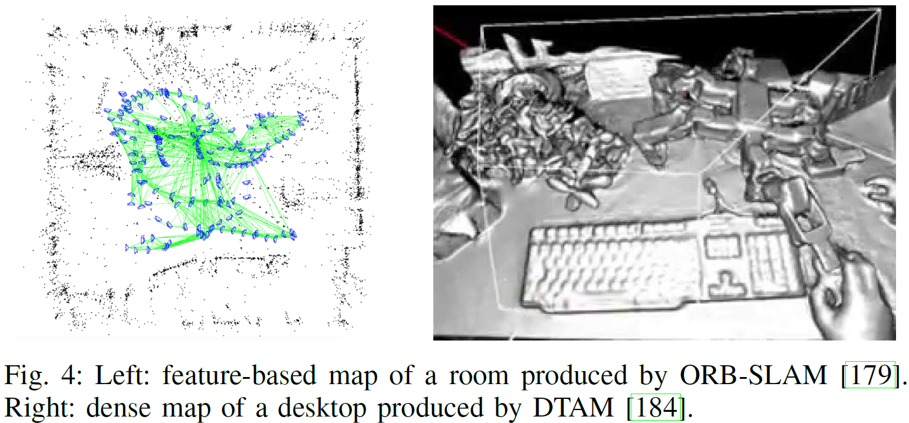

--- 
title: Past, present, and future of simultaneous localization and mapping Toward the robust-perception age
date:   2018-11-30
---

* content
{:toc}

以下来自：
CADENA C, CARLONE L, CARRILLO H等. Past, present, and future of simultaneous localization and mapping: Toward the robust-perception age[J]. IEEE Transactions on Robotics, 2016, 32(6): 1309–1332.

## 摘要
SLAM包含两个cocurrent的东西：
1. 构建环境的model(the map)
2. 估计环境中robot的state

其实就是：
>construction of a model of the environment (the map), and the estimation of the state of the robot moving within it.

深入本文之前，作者建议初学者看看 __这俩 SLAM tutorial__：
1. T. Bailey and H. F. Durrant-Whyte. Simultaneous Localisation and Mapping (SLAM): Part II. Robotics and Autonomous Systems (RAS), 13(3):108–117, 2006.
2. H. F. Durrant-Whyte and T. Bailey. Simultaneous Localisation and Mapping (SLAM): Part I. IEEE Robotics and Automation Magazine, 13(2):99–110, 2006.

## Introduction
### map 是啥
map 实际上就是描述 robot 环境中感兴趣的 aspect 的一种 representation。
>a representation of aspects of interest (e.g., position of landmarks, obstacles) describing the environment in which the robot operates.

### SLAM 很火的原因
SLAM 的流行和移动 robot 的室内应用分不开啊。
室内的话， 就没法使用 GPS来对定位误差进行 bound 了，并且，在没有用户的定位手段时，SLAM 提供了定位的功能。

过去30年，SLAM 很流行，因为它牵涉到很多方面。
1. 在底层，即前端部分，SLAM 涉及到 computer vision and signal processing
2. 在高层，涉及到 geometry, graph theory, optimization, and probabilistic estimation.
3. SLAM 专家要处理很多东西，从传感器的 calibration 到 system integration。

###  本文要回答两个问题
(1) do autonomous robots need SLAM? 
(2) is SLAM solved as an academic research endeavor?

#### do autonomous robots need SLAM? 
对于第一个问题，我们知道，SLAM 旨在利用 运动测量 和 回环检测 建立一个 globally consistent representation of the environment，
如果没有回环检测，那么 SLAM 就退化为 里程计，里程计可以利用轮式编码器实现，而且目前基于视觉和惯性信息（visual and inertial information）的 __里程计算法精度很高啦__，即小于总轨迹长度的 $0.5%$，那么问题来了，do we really need SLAM？
1. 上面我们提到的 visual-inertial odometry algorithms 正是因为有 SLAM 的研究才产生的，因此，在这个意义上，Visual-Inertial Navigation 就是 SLAM。
2. 只有添加了 回环检测，才能得到环境的真实拓扑。有人说了，不做 SLAM 啦，直接做 place recognition 不就行了？不行啊，要想让 place recognition 更加  much simpler and more robust，必须得有 __metric 信息__，这样才能处理好 wrong data association and perceptual aliasing （环境中不同的东西看起来一样）的情形。
3. 只要你需要 globally consistent map，就需要 SLAM。

#### is SLAM solved as an academic research endeavor?
对于第二个问题，由于 SLAM 现在是一个非常宽泛的topic了，因此不好回答了。
故，必须限定以下范围，才能评估 SLAM 问题的成熟度。
1. 对于robot而言：运动类型，传感器类型，以及计算资源
2. 对于环境而言：二维或三维，是否有人工的landmark，动态元素多不多，对称性以及 perceptual aliasing 有木有。
3. 性能需求：robot状态的估计精度是多少，以及环境的representation的类型和精度是啥，success rate，地图尺寸等。

鉴于此，
1. 对于 2D 室内环境的建图，配有 wheel encoders and a laser scanner，如果我们要求< 10cm的误差，以及 low failure rate，已经成熟啦。
2. 基于视觉的慢速移动的robot（例如 Mars rovers），以及 visual-inertial odometry （里程计）等已经成熟啦。

而其他情形则仍需大量研究：
1. fast robot dynamics, highly dynamic environments
2. 性能要求高的时候，如对于闭环控制，我们需要high rate estimation

### SLAM 第三个时期，the robust-perception age
the robust-perception age 的关键需求：
1. robust performance： 系统需要 fail-safe mechanisms 以及参数的 self-tuning capabilities。
2. high-level understanding： 即，SLAM 系统要把眼界放宽，不要满足于 geometry reconstruction，要去 obtain a high-level understanding of the environment。
3. resource awareness: 能够根据已有的传感器和计算资源进行裁剪，并调整算力。
4. task-driven perception:能选择相关的信息，忽略不相关的传感器数据。你根据不同的任务产生自适应的 map representations。

## 现代 SLAM 系统的术语
### 后端
将 SLAM formulate 成最大后验问题，且经常使用 因子图（factor graphs）对变量之间的依赖进行推理（reason）。

后端的估计变量 $\mathcal{X}$ 包含了 robot 的轨迹（一系列姿态的集合）以及环境中 landmark 的位置。
每一个观测变量 $z_k$ 都能表示成 $\mathcal{X}_k$ 的函数，即：$z_k=h_k(\mathcal{X}_k)+\epsilon_k$

若假设个观测独立，那么就可变成如下问题：
$$\mathcal{X}^*=\arg\max_{\mathcal{X}}p(\mathcal{X})\prod_{k=1}^mp(z_k|\mathcal{X}_k)$$

这个式子可以方便地用因子图进行阐述，因子图能够将问题可视化，且可以建模复杂的 inference 问题。

若假设噪声 $\epsilon_k$ 为零均值高斯随机变量，那么最大后验就转化为一个非线性最小二乘问题：
$$\mathcal{X}^*=\arg\min_{\mathcal{X}}p(\mathcal{X})\sum_{k=0}^m\parallel h_k(\mathcal{X}_k)-z_k \parallel_{\Omega_k}^2$$

SLAM 的这个式子和 Structure from Motion 的 bundle adjustment (BA) 很像，
那么 SLAM 和 BA 有啥区别呢？
1. SLAM 能比 BA 时间更多的限制，BA 只能建模射影几何（model projective geometry），而 SLAM 还包含传感器的模型，如惯性传感器，轮式编码器以及 GPS 等，还能考虑不同视角导致的姿态的变化，以及同样位置像素的强度变化。
2. 在 SLAM 中，上式需要进行增量式求解，因为 robot 每次移动的时候都会有新的测量值。

最小化问题通常使用连续线性化方法（successive linearizations）来解决，如高斯牛顿法，LM 法。
这些方法从初始guess进行迭代，使用二次cost来逼近 $\mathcal{X}$ 处的损失函数，然后通过求解一堆线性方程（normal equations）以optimized in closed form。

SLAM solver 的关键 insight 就是，normal equations 的矩阵具有稀疏性，利用这个稀疏性就能设计 incremental (or online) solvers，作者提到 __两个tutorial__：
1. F. Dellaert. Factor Graphs and GTSAM: A Hands-on Introduction. Technical Report GT-RIM-CP&R-2012-002, Georgia Institute of Technology, Sept. 2012.
2. G. Grisetti, R. K¨ummerle, C. Stachniss, and W. Burgard. A Tutorial on Graph-based SLAM. IEEE Intelligent Transportation Systems Magazine, (4):31–43, 2010

这俩教程介绍了两个流行的 SLAM 库，并提供了大量现实 SLAM 问题的例子。

以上介绍的SLAM可以称为： maximum a posteriori estimation, factor graph optimization, graph-SLAM, full smoothing, or smoothing and mapping (SAM).

现在流行的 pose graph optimization 则是将估计变量限定为 robot 轨迹的抽样。

以上 MAP 的估计比早期的基于非线性滤波（EKF）的 SLAM 更精确有效。
但基于EKF的SLAM也能取得 sota 的效果，如
1. EKF 的线性化的位置足够准确时
2. 使用滑窗法时
3. 处理好 EKF 中的 potential sources of inconsistency 时。

由于 MAP 估计是在传感器数据预处理的结果上进行的，因此一般称为 __SLAM 后端__。

### 前端
前端直接和 传感器 数据打交道，因此是 sensor dependent。
在 MAP 中传感器测量可以写为 state的解析函数，但前端面对的是 raw data，就很难这么办了。
例如 image 中是pixel的intensity。

因此，前端需要从传感器中数据中提取相关的特征，例如
1. 提取关键像素的位置
2. 将测量和路标结合（data association），也就是将观测 $z_k$ 和 $\mathcal{X}_k$ 联系起来：$z_k=h_k(\mathcal{X}_k)+\epsilon_k$.
3. 前端要为后端的非线性优化提供初始值。

前端的 data association 模块包含两部分，即 短期data association block以及长期data association block。
1. 短期data association block负责将相邻传感器测量中的特征进行对应，例如确定相邻帧的两个像素点属于同一个 3D 点的测量值。
2. 长期data association block负责将新的测量值赋给以前的路标点（older landmarks）。

当然，后端也需要将信息反馈到前端，用来进行回环检测及回环验证。

## LONG-TERM AUTONOMY I: ROBUSTNESS
AUTONOMY：自主性

SLAM 系统的脆弱性体现在算法上或硬件上，
1. 算法上，难以处理 extremely dynamic or harsh environments
2. 硬件上，传感器或执行结构的 degradation

要想长期运行，就得显示地处理这两种failure mode，因此
1. 就不要对环境做出static的假设
2. 不要完全信任传感器数据。

算法failure的一个来源就是 data association：
1. Perceptual aliasing 的时候，即不同的输入会产生相同的输出
2. data association 还可能拒绝掉正确的传感器数据，这样传感器数据就很少啦。

作者总结出以下 Open Problems.
1. Failsafe SLAM and recovery。 目前的SLAM solvers对于outlier的存在依然很vulnerable，因为它们都是基于非凸损失函数的迭代优化啊。一个理想的SLAM solution必须得是 fail-safe and failure-aware，并且能够在马上要fail的时候提供recovery机制。这就需要前端和后端的紧密integration啦。
2. Robustness to HW failure。如何检测degraded sensor operation，如何处理不同传感器的明显冲突的信息。
3. Metric Relocalization。这个Metric Relocalization就是根据先前建的map估计相对位姿。目前appearance-based能够将白天黑夜或不太季节的数据 对应起来，从而close loops，而基于特征的metric relocalization就没这么好啦，作者提出可以利用 spatial information 克服这个局限，另外在map 和定位的时候用不同的传感器也行。
4. Time varying and deformable maps:主流的slam算法都有rigid and static world assumption，理想的slam solution肯定得在包含non-rigidity的环境中对dynamics进行推理。目前已有小尺度的非刚体重建，大尺度的不好搞。
5. Automatic parameter tuning。对于一个给定的情形，要想有好效果，现在的slam系统总是有很多参数需要调，特别是data association模块。要想在任意的scenarios下都能work，必须得自动调参。

## LONG-TERM AUTONOMY II: SCALABILITY
前面提到slam问题可用因子图解释，在很多应用中，如海洋探索，因子图的规模就会特别大，因此我们希望slam系统的计算复杂度和memory复杂度remains bounded.

作者总结出以下 Open Problems.
1. Map representation. 就是怎么保存地图啦，可以根据压缩地图进行定位，以及使用 memory-efficient dense reconstruction。
2. Learning, forgetting, remembering。要想做long-term mapping，就得确定更新地图信息的频率，决定某信息是否过时并丢弃等等。
3. Robust distributed mapping。对于单一robot的outlier rejection已有解决方案了，多robot 的slam几乎还没有。
4. Resource-constrained platforms。如何将已有的slam算法移植到只有极少计算资源的robotic 平台上。我们希望slam系统有一个开关，以允许在accuracy 和 computational cost之间进行妥协。

## REPRESENTATION I: METRIC MAP MODELS
本节介绍如何在slam中建模geometry。
即，用来编码环境中的geometry的符号结构，就是metric representation。

2D 的时候Geometric modeling是很简单的，有两大类方法：
1. landmark-based maps，将环境建模为路标的稀疏集合
2. occupancy grid maps.将环境离散化成cell，然后给每一个cell赋一个占据概率。

这俩已经有标准啦，是IEEE RAS Map Data Representation Working Group搞的，即：
>IEEE RAS Map Data Representation Working Group. IEEE Standard for Robot Map Data Representation for Navigation, Sponsor: IEEE Robotics and Automation Society. http://standards.ieee.org/findstds/standard/1873-2015.html/, June 2016.IEEE.

但是，3D geometry modeling 就很复杂了，我们对“如何在mapping的时候有效地model 3D geometry”的理解尚处于infancy时期。
1. Landmark-based or feature-based sparse representations。
2. Low-level raw dense representations。dense representations 期望提供 3D geometry 的高分辨率模型。例如点云。在单目slam中，利用 __直接法__（direct methods），从像素中直接估计robot的轨迹以及3D模型。更复杂的还有surfel maps。
3. Boundary and spatial-partitioning dense representations.即不满足于low-level primitives (e.g., points)，并试图显示地表征surfaces (or boundaries) and volumes。Boundary representations (b-reps)将 3D物体定义为 surface boundary 的形式，并且已经有人用啦。更general的 b-reps 包括curve-based representations，surface mesh models 以及 implicit surface representations。

这俩哪一个好啊，feature-based or direct methods？
大多数特征检测器是为速度优化的而非为精度优化的，而直接法能够直接利用raw像素信息，因此在具有贫纹理，defocus, and motion blur的时候比基于特征的方法效果好，但一般需要GPU假设才能实时。
而Semidense methods 通过利用具有强梯度的像素克服了dense方法的高算力需求。
semi-direct methods能够利用稀疏特征(such as corners or edges)以及直接法，更加efficient，且由于利用了稀疏特征，因此能够同时估计structure and motion。

## NEW THEORETICAL TOOLS FOR SLAM
理论分析的三大原因：
1. slam算法和实现一般只在很少的问题（instance）是进行测试，因此很难理解这些结果能否繁华到其他问题（instance）上。
2. 理论结果能够有助于理解问题的本质属性，揭示经验结果中的反常的方面。
3. 理解了问题的结构以后，能够将算法扩展到现实世界中slam能够解决的其他问题上。

## 结论
###   对于 is SLAM necessary?
这得看应用，但基本上是大大的Yes。
从自动驾驶汽车到移动device都能部署slam。

在自动驾驶中，precision localization 经常通过将传感器数据与提前得到的高精度地图匹配来实现。
有了精确的地图，就不需要online SLAM啦。
但在highly dynamic 的环境中，就需要 dynamic online map updates，以应对road infrastructure的变化。将来，大量自动驾驶汽车得到的地图的分布式更新和维护就很值得研究。

选择最合适的slam系统的方法就是，将slam看做一种机制，即用来计算一个充分统计量，以汇总robot的所有观测。

###  对于 is SLAM solved?
这个问题，前面讲过了，我们已经进入了 robust-perception
age，因此得看robot、environment、performance combination的组合啦。
作为具有众多现实应用的学术探索（academic endeavor），SLAM is not solved。

没解决的问题包含四个方面：robust performance, high-level understanding, resource awareness, and task-driven inference。

相对于人类重建的地图而言，现有的slam的效果远远不行，没法提供 insightful, actionable,and compact models of the environment.